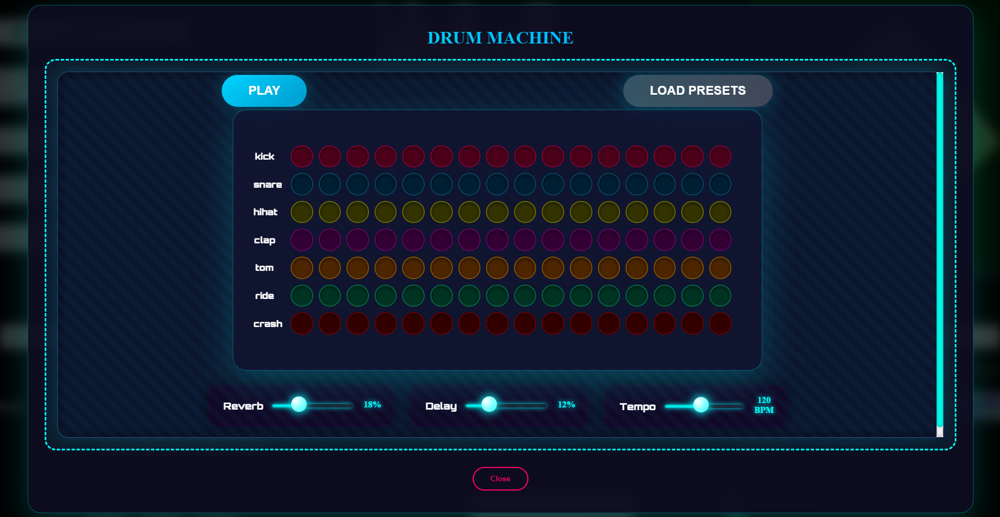
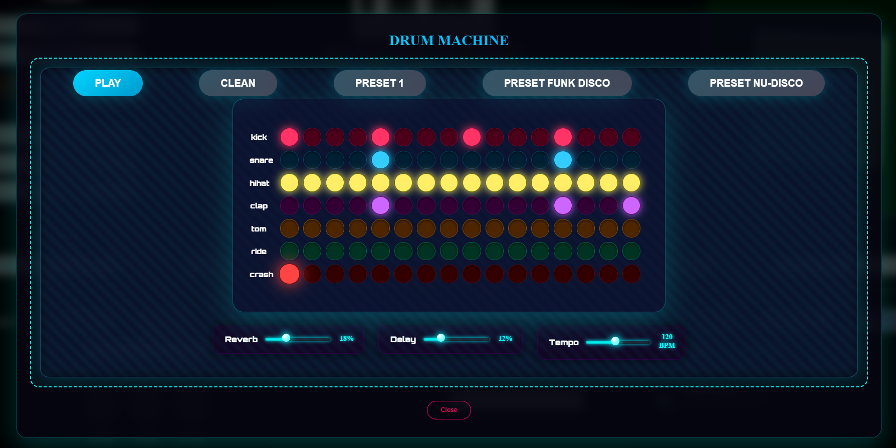
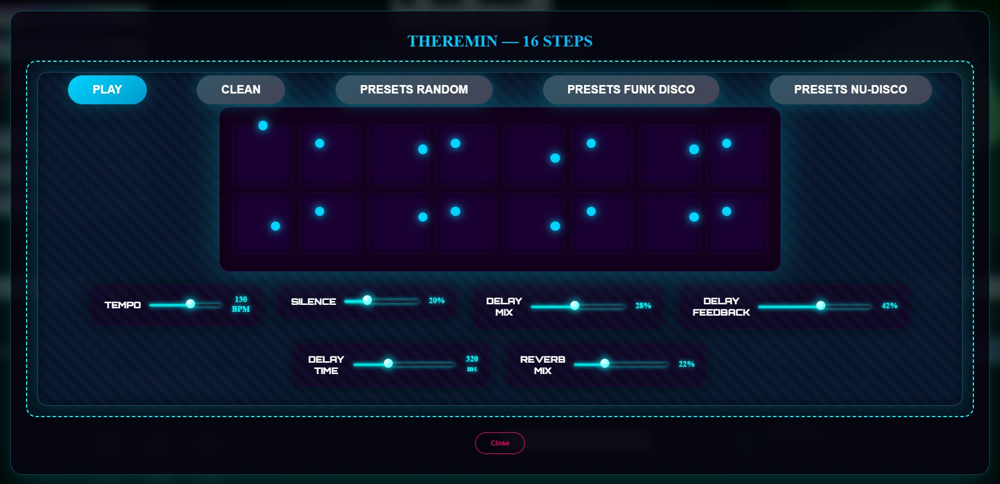
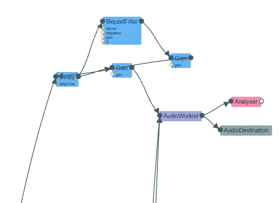
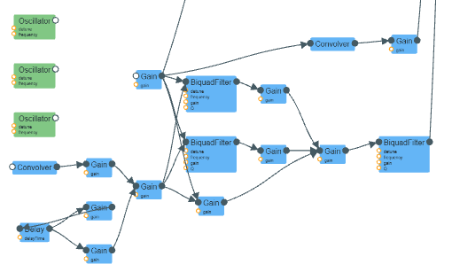

<a id="readme-top"></a>
<!-- PROJECT LOGO -->
<br />
<div align="center">
  <a href="https://github.com/pb402385/webaudio_with_webgl_animations/">
    
  </a>

<h3 align="center">Chargeur MP3/MP4 avec animations</h3>

  <p align="center">
    Chargeur MP3/MP4 avec animations (javascript et webGl) et piano en web audio
    <br />
    <a href="https://github.com/pb402385/webaudio_with_webgl_animations">Voir Demo</a>
  </p>
</div>


[](README_US.md)


<!-- TABLE OF CONTENTS -->
<details>
  <summary>Sommaire</summary>
  <ol>
    <li>
      <a href="#a-propos-du-projet">A propos du projet</a>
      <ul>
        <li><a href="#demo-video">Démo vidéo</a></li>
        <li><a href="#technologies">Technologies</a></li>
      </ul>
    </li>
    <li>
      <a href="#commencer">Commencer</a>
      <ul>
        <li><a href="#prérequis-et-installation">Prérequis et installation</a></li>
      </ul>
    </li>
    <li><a href="#presentation">Presentation de l'application</a></li>
    <li>
        <a href="#functionalities">Fonctionnalités</a>
      <ul>
        <li>
            <a href="#part-video">Partie Vidéo</a>
            <ul>
                <li><a href="#fonctionnement">Fonctionnement général</a></li>
                <li><a href="#video_params">Les paramètres vidéo</a></li>
            </ul>
        </li>
        <li>
            <a href="#part-audio">Partie Audio</a>
            <ul>
                <li><a href="#synthe">Le synthétiseur intégré</a></li>
                <li><a href="#melody">Les mélodies ou l'upload audio</a></li>
                <li><a href="#audio-params">Les paramètres audio</a></li>
                <li><a href="#drum-machine">La boîte à rythmes</a></li>
                <li><a href="#theremin">Le theremin</a></li>
                <li><a href="#sequencer">Le séquenceur</a></li>
            </ul>
        </li>
      </ul>
    </li>
    <li>
        <a href="#codereview">Explication du code</a>
      <ul>
        <li><a href="#code-video">Partie Vidéo</a></li>
        <li>
            <a href="#code-audio">Partie Audio</a>
            <ul>
                <li><a href="#code-init-audio-context">Initialisation du contexte Web Audio</a></li>
                <li><a href="#code-synthe">Code du Le synthétiseur</a></li>
                <li><a href="#code-melody">Code des mélodies</a></li>
                <li><a href="#code-audio-params">Code des paramètres/effets audio</a></li>
                <li><a href="#code-drum-machine-theremin">Code de la boîte à rythmes, du theremin et du séquenceur</a></li>
            </ul>
        </li>
      </ul>
    </li>
    <li><a href="#improvment">Points à améliorer</a></li>
    <li><a href="#license">License</a></li>
    <li><a href="#contact">Contact</a></li>
    <li><a href="#acknowledgments">Remerciements</a></li>
  </ol>
</details>

<!-- ABOUT THE PROJECT -->
## A propos du projet
<a id="a-propos-du-projet"></a>

Ce projet est un **lecteur audio MP3/MP4** avec des **visualisations animées** spectaculaires, codées en JavaScript et en shaders **GLSL** (WebGL). 

Il intègre également un **piano virtuel (synthétiseur)** qui permet de jouer des notes en direct avec le clavier ou la souris. Comme jouer précisément n'est pas toujours évident, j'ai préenregistré deux mélodies célèbres, reproduites fidèlement d'après leurs partitions:

- **The Imperial March** (Thème de Dark Vador) – composé par John Williams
- **La marche de Sacco et Vanzetti** (du film *Sacco et Vanzetti*) – composé par Ennio Morricone

Les animations sont **réactives à l'audio**: elles pulsent, ondulent et évoluent en temps réel en fonction du flux sonore. Elles sont entièrement paramétrables (couleurs, intensité, formes, etc.).

De plus, le son peut être modifié avec divers **effets audio** en temps réel (filtres, réverb, distortion, etc.) grâce à l'API Web Audio.

<p align="right">(<a href="#readme-top">back to top</a>)</p>

### Démo vidéo
<a id="demo-video"></a>

Voici une démonstration du rendu final de l'application (Cliquez sur l'image pour regarder la vidéo):

[](https://youtu.be/amGpBCkkSVQ)

<p align="right">(<a href="#readme-top">back to top</a>)</p>

### Technologies
<a id="technologies"></a>

* [WebGL](https://fr.wikipedia.org/wiki/WebGL)
* [Three.js](https://threejs.org)
* [WebAudioAPI](https://developer.mozilla.org/en-US/docs/Web/API/Web_Audio_API)
* [JavaScript](https://en.wikipedia.org/wiki/JavaScript)
* [HTML](https://en.wikipedia.org/wiki/HTML)
* [CSS](https://en.wikipedia.org/wiki/CSS)


<p align="right">(<a href="#readme-top">back to top</a>)</p>

## Commencer
<a id="commencer"></a>

### Prérequis et installation
<a id="prérequis-et-installation"></a>

Installez Node.js (https://nodejs.org/fr)

Téléchargez le projet, puis depuis la racine du projet, tapez la commande suivante afin de lancer le serveur
  ```sh
  python -m http.server 8000
  ```

Ensuite, rendez-vous à l'url suivante: <a href="http://localhost:8000/index.html">http://localhost:8000/index.html</a>

### Presentation de l'application
<a id="presentation"></a>

Vous arrivez sur la page de l'application


L'application utilise la **Web Audio API** pour analyser en temps réel le flux audio, qu'il provienne d'un fichier chargé (MP3/MP4/M4A) ou du **synthétiseur/piano intégré**.

Ce flux est analysé pour extraire diverses informations (fréquences, amplitude, rythme, etc.), qui servent à piloter à la fois:
- Des **effets audio** modifiables en direct: filtres (passe-bas, passe-haut...), égaliseur, réverbération, distortion, etc.
- De **magnifiques visualisations 2D/3D** rendues avec **WebGL** et des shaders **GLSL**.

Les données audio sont converties en une texture dynamique qui alimente les shaders, permettant aux animations de réagir précisément à la musique.

Tous les paramètres sont ajustables par l'utilisateur (Intensité et type des effets audio, comportement des animations visuelles)

<p align="right">(<a href="#readme-top">back to top</a>)</p>

## Fonctionnalités
<a id="functionalities"></a>

### Partie Vidéo
<a id="part-video"></a>

Comme expliqué un peut plus haut, le son est transformé en une **texture2D** (une image) qui représente l'instant **T** de la variation du son, cette texture peut être utilisée en glsl (Web GL) afin de modifier en temps réels les vecteurs de l'animation graphique.

#### Fonctionnement général
<a id="fonctionnement"></a>

<div align="center">
Voici à quoi ressemble un exemple de cette texture à un instant T
</div>
<br/>
<div align="center">
    
</div>


Initialement, le projet commence avec des **formes 3D personnalisables** (shapes), affichées en trois dimensions et animées en temps réel selon l’intensité du son. Une **coupe 2D** a ensuite été intégrée pour déformer ces formes de façon ondulatoire, ajoutant une dimension visuelle supplémentaire. En mode 3D, on peut enfin **répéter la forme à l’infini**, générant un effet hypnotique de duplication sans fin.

<div align="center">
Par exemple, voici une capture du Torus en 3D
</div>
<br/>
<div align="center">
    
</div>

<div align="center">
Et de sa version 2D
</div>
<br/>
<div align="center">
    
</div>

<div align="center">
Si un audio est actif, la géométrie de la figure est modulée par la texture2D évoquée plus haut. Illustration ci-dessous d’une déformation en 3D.
</div>
<br/>
<div align="center">
    
</div>


<div align="center">
Et de sa version 2D
</div>
<br/>
<div align="center">
    
</div>


<div align="center">
On peut également démultiplier la figure à l'infini comme sur l'illustration ci-dessous:
</div>
<br/>
<div align="center">
    
</div>


<div align="center">
On peut également ajouter un effet de twist sur la géométrie de la figure
</div>
<br/>
<div align="center">
    
</div>

<p align="right">(<a href="#readme-top">back to top</a>)</p>

#### Les paramètres vidéo
<a id="video_params"></a>
Voici les différents paramètres disponibles pour la partie vidéo

<div align="center">
    
</div>

**Paramètres disponibles:**

1. **Base Shape** (*): Permet de sélectionner la forme géométrique de base. **Options disponibles**: Carré, Petit carré, Tore, Petit tore, Hexagone, Cône et Cercle.

2. **Animation** (*): Définit le mode de rendu de la forme: en **3D** ou en **2D**. Si l’option **NONE** est sélectionnée, seule la texture 2D générée en temps réel par le son est affichée (image générée par le son en temps réel qui permet d'altérer visuellement les animations)

3. **Ondulation** (*): Contrôle l’intensité de la déformation de la forme géométrique en fonction du signal audio. Plus la valeur est élevée, plus la déformation est prononcée.

4. **Single/infinity** (*): Choisit entre l’affichage d’une unique forme ou la duplication infinie de celle-ci dans l’espace, grâce à une répétition de la matrice.

5. **Effect**: Les effets marqués (SHAPE) influencent directement la géométrie de la forme (*) en la déformant légèrement. Les autres effets proposent des animations indépendantes de la forme de base: leur apparence varie en fonction de la texture 2D, ce qui permet d’enrichir et de diversifier le rendu visuel global.

6. **Type**: Remplace le paramètre Ondulation lorsque l'on n'est pas dans le cas d'une forme (*), il permet de modifier l'animation 3D ce qui la rend un peu paramétrable dans le but de produire des rendus visuels légèrement différents

(*) Indique que cela ne concerne uniquement que les formes géométriques (SHAPE)

Voici une courte vidéo présentant les différentes animations possibles dans leur état de base, sans l’influence de la texture 2D générée par le son.

https://github.com/user-attachments/assets/ea8c63dd-818e-44c1-a017-e59964816623


On peut lancer une génération d'animations aléatoires en cliquant sur le bouton juste à côté du titre effet dans le menu vidéo (voir capture) 

<div align="center">
    
</div>

Celui-ci nous ouvre une pop-in listant toutes les animations et nous permettant de les sélectionner afin qu'elles soient dans une liste de lecture

<div align="center">
    
</div>

<p align="right">(<a href="#readme-top">back to top</a>)</p>

### Partie Audio
<a id="part-audio"></a>

#### Le synthétiseur intégré
<a id="synthe"></a>

**Le synthétiseur intégré** permet de générer le flux audio en temps réel. Il repose sur des oscillateurs fournis par l’API Web Audio, qui nous permettent de produire toutes les notes souhaitées. Il est possible de modifier le **type d’onde** (Triangle, Sine, Square ou Sawtooth) pour altérer sensiblement la timbre et la tonalité du son.

Voici une courte vidéo de présentation:

[](https://youtu.be/amGpBCkkSVQ)

#### Les mélodies ou l'upload audio
<a id="melody"></a>

Les mélodies préprogrammées: il s’agit de séquences musicales simulées, comme si une partition était lue et interprétée en direct par le synthétiseur, sans que vous ayez à jouer vous-même.

Deux mélodies sont actuellement disponibles:  
- La Marche impériale (de Star Wars)  
- La marche de Sacco et Vanzetti

Le bouton **STOP** permet de **tuer tout le contexte Audio** (fonctionne à tout moment)

3 autres boutons ont également été rajoutés, le premier permettant d'ouvrir une popin avec un **Thérémine**, le second permettant d'ouvrir une popin avec une **boîte à rythme**, enfin le troisième bouton permet d'ouvrir une popin avec un **Sequencer** de 4 instruments (guitare, basse, trompette et saxophone).


<div align="center">
    
</div>

Sinon on peut charger directement un fichier audio aux formats MP3, MP4 ou M4A.

<div align="center">
    
</div>

Une fois le fichier audio chargé, les canvas s’animent automatiquement:  Les deux premiers affichent des visualisations en temps réel du son (le premier représente l’amplitude des fréquences, tandis que le second montre la forme temporelle de l’onde elle-même). 

Le graphique du bas présente le spectre audio complet du fichier uploadé (répartition des fréquences).

<div align="center">
    
</div>


<p align="right">(<a href="#readme-top">back to top</a>)</p>

#### Les paramètres audio
<a id="audio-params"></a>

<div align="center">
    
</div>

Les paramètres suivants sont disponibles:

1. **Volume**: permet de monter ou diminuer le volume du son (**valeur comprise entre 0 et 100%**)
2. **Equalizer**: permet de paramétrer manuellement la valeur des fréquences autorisées (high,mid et low) (**valeur comprise entre 0 et 100%** pour chaque type)
3. **Filtre**: permet de choisir le filtre utilisé, il est associé à une fréquence qui peut être modifiée (les différents filtres sont: **Low Pass** (120 Hz), **High Pass** (120 Hz), **Band Pass** (800 Hz), **Low Shelf** (180 Hz), **High Shelf** (6000 Hz), **Peaking** (1000 Hz), **Notch** (500 Hz) et **All Pass** (500 Hz))
4. **Effects**: permet d'activer 1 effet sur le son parmi la liste suivante: (ceux ayant un astérisque peuvent être paramétrés)

    - **MOOG**: le filtre produit un son "crémeux" (creamy), gras et musical (utile avec le Le synthétiseur intégré ou certaines musique utilisant des synthétiseurs).

    - **NOISE** (*): le filtre produit l'ajout intentionnel d’un signal de bruit (noise) pour créer une texture sonore, enrichir un son ou produire un effet artistique.

    - **PITCH** (*): le filtre modifie le son qui devient plus aigu (pitch plus haut) ou plus grave (pitch plus bas) tout en gardant exactement la même longueur.

    - **BIT CRUSHER** (*): le filtre produit un effet audio numérique qui simule la dégradation sonore d’un signal audio en réduisant volontairement sa qualité, comme le faisaient les vieux équipements numériques à faible résolution (consoles 8-bit, samplers anciens, etc.).

    - **SIMPLE LOWPASS**: le filtre produit un effet audio qui laisse passer les basses fréquences (les graves) tout en atténuant ou en coupant les hautes fréquences (les aigus).

    - **COMPRESSOR** (*): le filtre produit un effet audio qui réduit automatiquement la dynamique d’un signal audio, c’est-à-dire l’écart entre les parties les plus faibles et les plus fortes.

    - **REVERB**: le filtre produit un effet audio qui simule la résonance naturelle d’un espace acoustique (comme une pièce, une salle, une cathédrale, une grotte, etc.).

    - **TREMOLO** (*): le filtre produit un effet audio qui consiste à moduler périodiquement le volume (amplitude) d’un signal sonore, créant une variation régulière de loudness (fort → faible → fort → faible…).

    - **FFT FX** (*): le filtre produit un effet audio basé sur la Fast Fourier Transform (Transformation de Fourier Rapide), une algorithmique mathématique qui décompose un signal audio temporel en ses composantes fréquentielles (spectre de fréquences)

5. **Speed Melody**: permet d'ajuster la vitesse des 2 mélodies pré enregistrées (**valeur comprise entre 0.5x et 1.5x**)
6. **Type**: type de l'onde jouée par l'oscillateur ( **Triangle**, **Sine**, **Square**, **Sawtooth** ) ne concerne que les melodies et le synthétiseur intégré

Paramétrage avancé des effets:
<br/>
<div align="center">
    
</div>
<br/>
Détails des paramètrages disponibles par effet:

- **NOISE**: 4 types de bruit ajoutés
    * Bruit blanc - fortes pluies, télévision brouillée
    * Bruit rose - vent, cascade, méditation
    * Bruit brun - tonnerre lointain, mer agitée
    * Bruit bleu - un jet d'air, un sifflement

- **PITCH**: 4 effets possibles:
    * Octave supérieure
    * Octave inférieure
    * Démon / robot
    * Choeur léger

- **BIT CRUSHER**: 2 effets possibles:
    * Super lisse sans fermeture
    * Effet lo-fi extrême

- **COMPRESSOR**: 5 effets possibles:
    * Défaut
    * Nivellement doux
    * Effet de glue bus de groupe
    * Drum squash
    * Limiteur transparent

- **TREMOLO**: 3 effets possibles:
    * Défaut
    * Panoramique automatique large et lent (0,33 Hz)
    * Onde carrée ultra-nerveuse de 8 Hz (style dub/techno)

- **FFT FX**: 3 effets possibles:
    * Gel spectral
    * Scintillement / Flou spectral
    * Modificateur de hauteur ±2 octaves préservant les formants

<p align="right">(<a href="#readme-top">back to top</a>)</p>

#### La boîte à rythmes
<a id="drum-machine"></a>

<div align="center">
    
</div>

**La boîte à rythmes** est un instrument électronique conçu pour **générer des rythmes percussifs**, imitant généralement une batterie ou d'autres instruments de percussion comme les cymbales, le triangle ou le cabasa. Elle combine un séquenceur (pour programmer des motifs rythmiques) et plusieurs générateurs de sons.

La **séquence est de 16 échantillons** par génération de son qui se jouent en cas d'activation de la case, les types de sons sont les suivants:

1. **KICK**: Le Kick (ou Bass Drum) correspond en français à la grosse caisse. Il s’agit de l’élément le plus visible de la batterie : le fût posé à la verticale devant le batteur. C’est lui qui marque le plus souvent le tempo pour l’ensemble du groupe ou de l’orchestre, par des impacts, des coups de percussion dans les graves.
2. **SNARE**: Le snare correspond à la caisse claire. La caisse claire est l’élément essentiel de la rythmique à la batterie, c’est le fût qui se situe entre les jambes du batteur. On peut l’assimiler au tambour.
3. **HIHAT**: Le hi-hat ou high-hat correspond en français au charleston ou plus vulgairement « charley ». Le « charley » est le jeu de cymbales traversé par un axe verticale, placé le plus souvent à la gauche du batteur, et jouée grâce à une pédale.
4. **CLAP**: Le clap correspond à un son aigu, bref et percutant, simulant le bruit produit en claquant des mains.
5. **TOM**: Il s’agit des autres fûts que la caisse claire et la grosse caisse. Les 3 toms les plus communs sont au nombre de 3 (le tom alto et le tom medium et le tom basse).
6. **RIDE**: La ride est une cymbale placée à droite du batteur. Elle peut marquer le tempo en lieu et place du charley. Elle se frappe soit au-dessus de la cymbale avec l’olive, soit sur la tranche avec la tranche de la baguette.
7. **CRASH**: La crash est une cymbale située à la gauche du batteur. Elle sert principalement à accentuer des temps, amener une nouvelle mesure.

Il dispose de **3 effets**:
1. **REVERB**: L'effet de réverbération sur une boîte à rythme permet d'ajouter de la profondeur, de l'espace et de la cohérence à la batterie électronique (valeur comprise **entre 0 et 60%**).
2. **DELAY**: L'effet delay sur une boîte à rythme ajoute des répétitions temporisées à certains sons, pour créer de la profondeur ou des motifs rythmiques (valeur comprise **entre 0 et 50%**).
3. **TEMPO**: Le tempo sur une boîte à rythme détermine la vitesse du rythme, exprimée en BPM (battements par minute).  Il sert de base temporelle pour synchroniser les sons et les motifs (valeur comprise **entre 70 et 180 battements par minute**).

Il y a également la possibilité de sélectionner des **PRESETS** qui sont des exemples dont je me suis servi pour réaliser des démos (voir capture).

<div align="center">
    
</div>

Voici un exemple vidéo de la boite à rythme:

<p align="right">(<a href="#readme-top">back to top</a>)</p>

#### Le thérémine
<a id="theremin"></a>

<div align="center">
    
</div>

Le **thérémine** est un instrument de musique électronique inventé en 1920 par le physicien russe Léon Theremin (appelé Lev Termen). Il est joué sans contact physique, en déplaçant les mains près de deux antennes : l'une contrôle la hauteur du son (pitch), l'autre le volume. Le son est produit par la variation des champs électromagnétiques créés par le corps du musicien, qui perturbe les oscillateurs internes du dispositif. Dans l'application **la hauteur et le volume sont déterminés par l'axe XY choisit**.

Il dispose de **6 effets**:
1. **TEMPO**: Comme pour la boîte à rythme, il sert de base temporelle pour synchroniser les sons et les motifs (valeur comprise **entre 60 et 180 battements par minute**).
2. **SILENCE**: Permet contrôle du volume permet de créer des attaques précises, des silences rythmiques et des effets d’articulation, essentiels pour structurer une mélodie (valeur comprise **entre 0 et 70%**).
3. **DELAY MIX**: Permet de régler le niveau de mélange entre le signal sec (original) et le signal avec réverbération/délai (valeur comprise **entre 0 et 60%**).
4. **DELAY FEEDBACK**: Permet de contrôler le nombre de répétitions de l'écho (valeur comprise **entre 0 et 75%**).
5. **DELAY TIME**: Pour un contrôle précis du temps de delay (valeur comprise **entre 80 et 800 millisecondes**).
6. **REVERB MIX**: Permet d'ajuster l'intensité de l'effet de réververation (valeur comprise **entre 0 et 70%**).

On peut  également **charger des PRESETS** afin d'exploiter le séquenseur du thérémine, on peut également **muter certaines notes** afin d'optimiser l'instrument. 

Voici un exemple vidéo du thérémine:

<p align="right">(<a href="#readme-top">back to top</a>)</p>

#### Le Séquenceur
<a id="sequencer"></a>

<div align="center">
    
</div>

Le **séquenceur** est une sorte de de boîte à rythme mais qui simule des notes de différents instruments de musique (guitare, basse, trompette et saxophone). Les notes jouées correspondent aux fréquences suivantes dans la gamme tempérée:
- C5 : 523,25 Hz
- A4 : 440 Hz (diapason standard)
- G4 : 392 Hz
- E4 : 329,63 Hz
- D4 : 293,66 Hz
- C4 : 261,63 Hz (do central)
- A3 : 220 Hz
- G3 : 196 Hz

Il dispose de **2 effets**:
1. **BPM**: Comme pour la boîte à rythme, il sert de base temporelle pour synchroniser les sons (valeur comprise **entre 60 et 180 battements par minute**).
2. **Volume**: Permet le contrôle du volume, commun aux 4 instruments (valeur comprise **entre 0 et 100%**).

On peut  également **charger des PRESETS** (pratique pour des tests rapides)

<p align="right">(<a href="#readme-top">back to top</a>)</p>

## Explication du code
<a id="codereview"></a>

### Partie Vidéo
<a id="code-video"></a>

Le fonctionnement principal se situe dans le fichier **webgl.js**

Le code est initialisé en chargeant la partie GLSL au début, tout objet 3D est traité en deux grandes étapes principales pour les shaders: les vertex shaders et les fragments shaders. Ce sont les deux programmes écrits en GLSL qui tournent directement sur la carte graphique (GPU).

```javascript
async function loadShaders() {
  vertexSource = await fetch('webgl/vertexSource.glsl').then(res => res.text());
  fragmentSource = await fetch('webgl/fragmentSource.glsl').then(res => res.text());
  fragmentSourceUserShader = await fetch('webgl/fragmentSourceUserShader.glsl').then(res => res.text());
}
```

Le fichier **fragmentSource.glsl** contient la fonction mainImage qui sera éxécutée pour afficher notre animation 3D. Celui-ci importera en son sein le fichier  **fragmentSourceUserShader** qui contient le code de toutes les animations, celle que l'on aura sélectionné viendra alors surcharger le code de la fonction mainImage

Le chargement des paramètres nécessaires à l’animation WebGL, ainsi que du tableau de fréquences issu de l’analyse audio en temps réel, s’effectue à ce niveau du code.

```javascript
    dataTex = new THREE.DataTexture(arrayFreqToOpenGL, side, side, THREE.RGBAFormat);
	
	_uniforms = {
		iChannel0:			{ type: "t", value: dataTex },
		uIntEffect:			{ type: "i", value: effectToOpenGL},
		uIntInfinity:		{ type: "i", value: infinityToOpenGL},
		uIntFreq:			{ type: "i", value: freqToOpenGL },
		uIntType:			{ type: "i", value: typeToOpenGL },
		uIntTypeTexture:	{ type: "i", value: typeTextureToOpenGL },
		iGlobalTime:    	{ type: "f", value: 1.0 },
		iResolution: 		{ type: "v3", value: new THREE.Vector3() },
		iMouse: 			{ type: 'v4', value: new THREE.Vector2() },
	}
```

Les interactions de la souris avec le canvas d’animation 3D (clics, déplacements, zoom, etc.) sont gérées par des fonctions situées dans le fichier webgl.js. Ce fichier est l’endroit idéal pour ajouter de nouvelles interactions ou modifier le comportement existant.

```javascript
    //mouse effect management
	document.getElementById("shaderPixelAnim").appendChild(renderer.domElement);
	canvasClicked = false;
	renderer.domElement.addEventListener('mousemove', function(e) {
		if(canvasClicked == true){
			var canvas = renderer.domElement;
			var rect = canvas.getBoundingClientRect();
			mesh.material.uniforms.iMouse.value.x = -parseFloat((e.clientX - rect.left));
			mesh.material.uniforms.iMouse.value.y = -parseFloat((e.clientY - rect.top));
		}
	});
	renderer.domElement.addEventListener('mousedown', function(e) {
			var canvas = renderer.domElement;
			var rect = canvas.getBoundingClientRect();
			mesh.material.uniforms.iMouse.value.x = -parseFloat((e.clientX - rect.left));
			mesh.material.uniforms.iMouse.value.y = -parseFloat((e.clientY - rect.top));
			canvasClicked = true;
	});
	renderer.domElement.addEventListener('mouseup', function(e) {
		canvasClicked = false;
		var canvas = renderer.domElement;
		var rect = canvas.getBoundingClientRect();
		mesh.material.uniforms.iMouse.value.z = parseFloat((e.clientX - rect.left));
		mesh.material.uniforms.iMouse.value.w = parseFloat((e.clientY - rect.top));
	});
	renderer.domElement.addEventListener('wheel', function(e) {
		canvasClicked = false;
		if(e.wheelDelta > 0) {
			mesh.material.uniforms.iResolution.value.x = mesh.material.uniforms.iResolution.value.x + 50;
		} else {
			mesh.material.uniforms.iResolution.value.x = mesh.material.uniforms.iResolution.value.x - 50;
		}
	});
```

**Intégrer une animation GLSL et utiliser la texture audio en temps réel**

Je vais maintenant expliquer comment, en pratique, ajouter une nouvelle animation GLSL au projet, et surtout comment récupérer dans le code du shader la texture 2D générée à partir du son. Cette texture nous permettra de modifier les vecteurs (positions, déplacements, déformations, etc.) en fonction des variations du flux audio, créant ainsi des animations réactives au rythme et aux fréquences.

Pour commencer, la première étape consiste à **récupérer cette texture 2D**, qui est générée en temps réel à partir du tableau de fréquences issu de l’analyse audio:

```glsl
vec4 fragColorTexture = texture2D(iChannel0, iResolution.xy);
```

A titre informatif, on peut accéder soit à la position du vecteur de texture généré via les champs x, y et z (exemple: fragColorTexture.xy), soit également à leur couleur RGB via les champs r, g et b (exemple: fragColorTexture.rgb)

Ensuite il faut trouver l'endroit de l'animation qui nous interesse et à l'aide des informations que la texture nous envoit, réaliser des opérations qui altèrent notre animation (de préférence de manière harmonieuse)

On peut par exemple utiliser la fonction **mix** est une des fonctions les plus utiles et utilisées en GLSL (le langage des shaders dans WebGL, Three.js, OpenGL, etc.). Elle permet de faire une interpolation linéaire entre deux valeurs.

```glsl
    fragColor = mix(color, vec3(0.5), fragColorTexture.xyz);
```

On peut également utiliser la fonction **smoothstep** en GLSL (utilisée dans Three.js, WebGL, shaders en général) qui permet de créer des transitions douces (smooth transitions) entre deux valeurs. Elle est parfaite pour les animations fluides, les masques progressifs, les effets de fondu, etc.

```glsl
    fragColor = smoothstep(color, vec3(0.5), fragColorTexture.xyz);
```

Attention toutefois au **problème d’anti-aliasing**: il peut parfois provoquer des artefacts sur la partie gauche de l’animation ou générer des bords en escalier (staircasing) très visibles et peu esthétiques, surtout après l’utilisation d’un **smoothstep**.

Pas de panique, ce problème est facilement contournable avec la solution suivante !


```glsl
    // l'operation que l'on souhaite réaliser
    vec3 values = vec3(min(1.0,fragColorTexture.x), min(0.2,fragColorTexture.y), min(0.8,fragColorTexture.z));
    // Avec anti-aliasing adaptatif
    vec3 aa = fwidth(values);                         // vec3 avec fwidth par composante
    vec3 smooth = smoothstep(-aa, aa, values);
    col *=  smooth; 
```

On peut également modifier l'animation simplement en modifiant un nombre flottant, ou en faisant une multiplication de vecteurs, par exemple:

```glsl
    // modifier un flottant
    float dist = 0.5 + (fragColorTexture.x * 25.0);
    //multiplication de vecteurs
    vec3 fragColor = color * fragColorTexture.xyz;
```

<p align="right">(<a href="#readme-top">back to top</a>)</p>

### Partie Audio
<a id="code-audio"></a>

Le fonctionnement principal se situe dans le fichier webaudio.js

#### Initialisation du contexte Web Audio
<a id="code-init-audio-context"></a>

Tout d'abord il nous faut **initialiser le contexte Web Audio**, car depuis plusieurs années (Chrome 66+, puis tous les navigateurs), les politiques autoplay des navigateurs bloquent la lecture audio automatique pour éviter les pubs sonores intrusives, le contexte Web Audio est souvent créé en état suspended (suspendu) si pas initié directement par une interaction utilisateur (comme un clic ou un touch)

```javascript
// Fonction à appeler sur le premier clic/touch de l’utilisateur
async function unlockAudio() {
    if (isUnlocked) return;

    // Crée ou reprend l’AudioContext
    audioCtx = new AudioContext();

	// Start when user clicks or after resume (required on most browsers)
	document.documentElement.addEventListener('click', () => {
		if (audioCtx.state === 'suspended') audioCtx.resume();
		initAudio().then(() => {
			console.log("AudioContext débloqué et prêt !");
			isUnlocked = true;

			// Mets ici tout ce qui a besoin du son
			initAudioContext2();
		});

	}, { once: true });

    // Nettoyage : on ne veut appeler ça qu’une seule fois
    document.removeEventListener('click', unlockAudio);
    document.removeEventListener('touchstart', unlockAudio);
    document.removeEventListener('keydown', unlockAudio);
}
```

Une fois notre contexte Web Audio actif, on doit **charger tous les modules** qui nous seront nécessaires lors de la future création de notre graphe audio, ces audioWorklet Processor nous permettent de remplacer les ScriptProcessorNode / JavaScriptNode obsolètes tout en offrant des performances bien meilleures (le code s'exécute sur un thread séparé dans le contexte audio) et une latence plus faible et d'avoir un code spécifique par effet audio que l'on pourra utiliser dans nos modifications du flux audio.

```javascript
async function initAudio() {
    try {
      // This MUST be awaited and inside try/catch
      console.log("Loading processor...");
      await audioCtx.audioWorklet.addModule('./audio-worklet-processor.js');
      console.log("Processor (my-audio-processor) loaded successfully");

	  await audioCtx.audioWorklet.addModule('./effect/simple-lowpass.js');
	  console.log("Processor (simple-lowpass-effect) loaded successfully");

	  await audioCtx.audioWorklet.addModule('./effect/bit-crusher.js');
	  console.log("Processor (bit-crusher-effect) loaded successfully");

	  await audioCtx.audioWorklet.addModule('./effect/pink.js');
	  console.log("Processor (pink-effect) loaded successfully");

	  await audioCtx.audioWorklet.addModule('./effect/noise.js');
	  console.log("Processor (noise-effect) loaded successfully");

	  await audioCtx.audioWorklet.addModule('./effect/pitch.js');
	  console.log("Processor (pitch) loaded successfully");

	  await audioCtx.audioWorklet.addModule('./effect/compressor.js');
	  console.log("Processor (compressor) loaded successfully");

	  await audioCtx.audioWorklet.addModule('./effect/reverb.js');
	  console.log("Processor (reverb) loaded successfully");

	  await audioCtx.audioWorklet.addModule('./effect/tremolo.js');
	  console.log("Processor (tremolo) loaded successfully");

	  await audioCtx.audioWorklet.addModule('./effect/fft-fx.js');
	  console.log("Processor (fft-fx) loaded successfully");

      // Only now is it safe to create the node
      analyserNode = new AudioWorkletNode(audioCtx, 'my-audio-processor');
      console.log("AudioWorkletNode created and connected (my-audio-processor)");


	  // effects
	  simplePassEffectNode = new AudioWorkletNode(audioCtx, 'simple-lowpass', {
		parameterData: { cutoff: 800 }
	  });
	  console.log("AudioWorkletNode created and connected (simple-lowpass-effect-processor)");

	  bitCrusherEffectNode = new AudioWorkletNode(audioCtx, 'bitcrusher', {
		outputChannelCount: [2]
	  });

	  bitCrusherEffectNode.parameters.get('bitDepth').setValueAtTime(16, audioCtx.currentTime);
	  bitCrusherEffectNode.parameters.get('bitDepth').linearRampToValueAtTime(4, audioCtx.currentTime + 2);
	  console.log("AudioWorkletNode created and connected (bit-crusher-effect-processor)");

	  pinkEffectNode = new AudioWorkletNode(audioCtx, 'pink-noise-filtered');
	  pinkEffectNode.parameters.get('cutoff').linearRampToValueAtTime(200, audioCtx.currentTime + 5);
	  console.log("AudioWorkletNode created and connected (pink-effect-processor)");

	  pitchEffectNode = new AudioWorkletNode(audioCtx, 'pitch');
	  pitchEffectNode.parameters.get('pitch').setValueAtTime(2, audioCtx.currentTime);

	  console.log("AudioWorkletNode created and connected (pitch-effect-processor)");

	  noiseEffectNode = new AudioWorkletNode(audioCtx, 'noise');
	  noiseEffectNode.parameters.get('type').setValueAtTime(1, 0);        // pink
	  console.log("AudioWorkletNode created and connected (noise-effect-processor)");

	  compressorEffectNode = new AudioWorkletNode(audioCtx, 'compressor', {
		processorOptions: { channelCount: 2 }
	  });

	  compressorEffectNode.parameters.get('threshold').value = -24;
	  compressorEffectNode.parameters.get('ratio').value = 4;
	  compressorEffectNode.parameters.get('attack').value = 8;
	  compressorEffectNode.parameters.get('release').value = 120;
	  compressorEffectNode.parameters.get('makeup').value = 6;
	  compressorEffectNode.parameters.get('mix').value = 100;
	  console.log("AudioWorkletNode created and connected (compressor-effect-processor)");

	  reverbEffectNode = new AudioWorkletNode(audioCtx, 'reverb', {
		outputChannelCount: [2]
	  });

	  // Exemple de contrôle
  	  reverbEffectNode.parameters.get('roomSize').setValueAtTime(0.85, audioCtx.currentTime);
  	  reverbEffectNode.parameters.get('damping').setValueAtTime(0.3, audioCtx.currentTime);
  	  reverbEffectNode.parameters.get('wet').setValueAtTime(0.4, audioCtx.currentTime);
  	  reverbEffectNode.parameters.get('freeze').setValueAtTime(1, audioCtx.currentTime + 5); // freeze après 5s
	  console.log("AudioWorkletNode created and connected (reverb-effect-processor)");

	  tremoloEffectNode = new AudioWorkletNode(audioCtx, 'tremolo', {
		  outputChannelCount: [2],           // indispensable
		  channelCount: 2,                   // force 2 canaux en sortie
		  channelCountMode: 'explicit',
		  channelInterpretation: 'speakers'
	  });

	  // 3. Carré 8 Hz ultra-nerveux (style dub/techno)
	  tremoloEffectNode.parameters.get('rate').setValueAtTime(8, audioCtx.currentTime);
	  tremoloEffectNode.parameters.get('shape').setValueAtTime(2, audioCtx.currentTime);
	  tremoloEffectNode.parameters.get('smooth').setValueAtTime(0.7, audioCtx.currentTime); // adoucit le carré
	  console.log("AudioWorkletNode created and connected (tremolo-effect-processor)");

	fftFxEffectNode = new AudioWorkletNode(audioCtx, 'fft-fx');
	fftFxEffectNode.parameters.get('mode').setValueAtTime(0, audioCtx.currentTime);
	fftFxEffectNode.parameters.get('freeze').setValueAtTime(1, audioCtx.currentTime + 2); // pad infini !

console.log("AudioWorkletNode created and connected (fft-fx-effect-processor)");
    } catch (err) {
      console.error("Failed to load AudioWorklet module:", err);
      // This is where you’ll see the real error (syntax, 404, CORS, etc.)
    }
}
```

On arrive au moment où on peut enfin créer les nœuds nécessaires pour monter notre graphe audio.

```javascript
function initAudioContext2(){
	try{
		
		//We connect the sound's node
		gainNode = audioCtx.createGain();
		gainNode.gain.value = (20/100) * (20/100);
		
		//sound equalizer
		hBand = audioCtx.createBiquadFilter();
		lBand = audioCtx.createBiquadFilter();	
		lGain = audioCtx.createGain();
		mGain = audioCtx.createGain();
		hGain = audioCtx.createGain();
		
		//filter
		filter = audioCtx.createBiquadFilter();
		
		//We create a node to analyze as well as a javascript node
		analyser = audioCtx.createAnalyser();
			
		//Creation of oscillators
		oscillator = audioCtx.createOscillator();
		oscillator1 = audioCtx.createOscillator();
		oscillator2 = audioCtx.createOscillator();
		oscillator0 = audioCtx.createOscillator();
		
		oscillator.start(0);
		oscillator1.start(0);
		oscillator2.start(0);
		oscillator0.start(0);
		
		var cpt = 0;
		for (key in tabKeyNotes) {
			oscillatorTab[cpt] = audioCtx.createOscillator();
			oscillatorTab[cpt].start(0);
			cpt++;
		}

		buidGraph();
		setDefaultValues();
		
	}catch(e){
		alert('Web Audio API is not supported in this browser');
	}
}
```

On peut maintenant assembler notre graphe audio: configuration des nœuds d’égaliseur, de gain (volume), de filtre et d’analyse, lancement des deux méthodes permettant de dessiner les deux courbes d'analyse de l'audio en temps réel et enfin, connexion finale au nœud de destination.

```javascript
function buidGraph(){
		/** PARAM EGALISEUR **/
		hBand.type = "lowshelf";
		hBand.frequency.value = bandSplit[0];
		hBand.gain.value = gainDb;

		lBand.type = "highshelf";
		lBand.frequency.value = bandSplit[1];
		lBand.gain.value = gainDb;
		lBand.connect(lGain);
		hBand.connect(hGain);

		// Connect the sound sample to its volume node
		lGain.connect(gainNode);
		mGain.connect(gainNode);
		hGain.connect(gainNode);

		/** END PARAM EGALISEUR **/
		gainNode.connect(filter);
		
		filter.connect(analyserNode);	
		analyserNode.connect(analyser);

		function draw1() {
			draw(analyser);
			requestAnimationFrame(draw1);
		}
		draw1();

		function draw2() {
			drawWave(analyser);
			requestAnimationFrame(draw2);
		}
		draw2();
		
		analyserNode.connect(audioCtx.destination);	

		let frontCanvasTimeline = document.getElementById("spectreTimelineMP3");
		frontCanvasTimeline.addEventListener("mousedown", function(event) {
			console.log("mouse click on canvas, let's jump to another position in the song")
			var mousePos = getMousePos(frontCanvasTimeline, event);
			// will compute time from mouse pos and start playing from there...
			jumpTo(mousePos);
		})
}
```

Voici une capture d’écran de notre graphe Web Audio, présenté de manière simplifiée. Je n’ai pas représenté tous les AudioWorkletNode (car il y en a un très grand nombre en raison des nombreux effets), ni tous les OscillatorNode (un par touche du synthétiseur intégré, ce qui rendrait le graphe beaucoup trop chargé et illisible).

<div align="center">
    
</div>

Depuis que l'on a ajouté la boîte à rythmes ainsi que le thérémine, le nouveau graphe ressemble à ceci (l'image est en 2 parties car il est beaucoup trop grand pour tenir sur une seule image):

<div align="center">
    
</div>

<div align="center">
    
</div>

Notre graphe étant enfin terminé, notre application est opérationnelle! On remarque que l'on a deux fonctions draw qui sont exécutées permettant de dessiner nos courbes en temps réel. Il est à noter un point important, c'est dans la méthode **draw** que nous obtenons le tableau de fréquences (via analyserNode.getByteFrequencyData()) que nous envoyons en temps réel à la partie vidéo/WebGL 3D.

```javascript
    if(analyser.frequencyBinCount){
		frequencyData = new Uint8Array(analyser.frequencyBinCount);
		analyser.getByteFrequencyData(frequencyData);
	} 

	..........

	arrayFreqToOpenGL = frequencyData;
```

Ce code permet de charger un fichier audio (**MP3, MP4, M4A**) via un champs input de type file. Ensuite, on decode le contexte audio et on crée le noeud source, ensuite on connecte ce noeud source à notre graphe audio, on dessine son spectre et enfin on démarre la lecture de la musique via source.start().

```javascript
function loadInputSound(element) {
	
	loadAudio(element.files[0]);
	if(isUnlocked) document.getElementById("currentMp3").innerHTML = element.files[0].name;

	// Method 1: Create a completely new input (recommended)
	element.type = 'text';  // temporary change
	element.type = 'file';  // back to file – this clears it

}

async function loadAudio(file) {
	try {
	  // Load an audio file
	  // Decode it
	  audioCtx.decodeAudioData(await file.arrayBuffer(), playBuffer);
	} catch (err) {
	  console.error(`Unable to fetch the audio file. Error: ${err.message}`);
	}
}

soundMP3_is_loaded = false;

var mp3Buffer;
var source;

function playBuffer(buffer) {

	if(!isUnlocked) {
		openPopin();
		return;
	}
	
	safeDisconnect(source);
	source = audioCtx.createBufferSource();
	source.buffer = buffer;
	mp3Buffer = buffer;
	drawTrack(buffer,1,0);
	source.connect(lBand);
	source.connect(hBand);
	source.connect(mGain);
	source.connect(gainNode);

	source.loop = true;
	source.start();
	paused = false;
	restartMp3IconColor();

	lastTime = audioCtx.currentTime;

	soundMP3_is_loaded = true;
	elapsedTimeSinceStart = 0;
	animateTime();

	// Optional: configure
	source.loop = true;

	// Add ended handler (optional but recommended)
	source.onended = () => {
		source.disconnect(); // clean up
		source.buffer = null; // aide le garbage collector
	};
}
```

<p align="right">(<a href="#readme-top">back to top</a>)</p>

#### Code du synthétiseur
<a id="code-synthe"></a>

Quant au synthétiseur intégré, il est entièrement généré par du code JavaScript.

```javascript
    /**PART binding keys of keyboard **/
    var tabNoteInfo = ['LA<br>2','LA<br>#2','SI<br>2','DO<br>3','DO<br>#3','RE<br>3','RE<br>#3','MI<br>3','FA<br>3','FA<br>#3','SOL<br>3','SOL<br>#3','LA<br>3','LA<br>#3','SI<br>3','DO<br>4'];
    var tabTouches = ['q','z','s','d','r','f','t','g','h','u','j','i','k','o','l','m'];
    var tabTouchesBool = [false,false,false,false,false,false,false,false,false,false,false,false,false,false,false,false];
    //TODO to erase (mini note test table) #testNote //!\\ onclick events work with a delay, not like keys
    var strTestNote = "<table><tr><td class='topPiano' id='topPiano0'>&nbsp;</td><td class='topPiano' id='topPiano2'>&nbsp;</td><td class='topPiano' id='topPiano3'>&nbsp;</td><td class='topPiano' id='topPiano5'>&nbsp;</td><td class='topPiano' id='topPiano7'>&nbsp;</td><td class='topPiano' id='topPiano8'>&nbsp;</td><td class='topPiano' id='topPiano10'>&nbsp;</td><td class='topPiano' id='topPiano12'>&nbsp;</td><td class='topPiano' id='topPiano14'>&nbsp;</td><td class='topPiano' id='topPiano15'>&nbsp;</td></tr><tr>";
    var strTestNoteDiese = "<table><tr>";
    for(var j=0; j<tabFrequences.length; j++){
        if(j !== 1 && j !== 4 && j !== 6 && j !== 9 && j !== 11 && j !== 13){
            strTestNote = strTestNote + "<td class='testNoteTD' id='testNoteTD"+j+"' onmousedown='play("+j+",false)' onmouseup='stop("+j+",false)' onmouseover='setPianoHover(" + j + ",1,true);' onmouseout='setPianoHover(" + j + ",1,false);'>" + tabTouches[j] + "<p class='pPiano'>" + tabNoteInfo[j] + "</p></td>";
        }else{
            strTestNoteDiese = strTestNoteDiese + "<td class='testNoteDieseTD' id='testNoteDieseTD"+j+"'  onmousedown='play("+j+",false)' onmouseup='stop("+j+",false);this.style.backgroundColor=\"black\"' onmouseover='setPianoHover(" + j + ",0,true);' onmouseout='setPianoHover(" + j + ",0,false);'>" + tabTouches[j] + "<p class='pPiano'>" + tabNoteInfo[j] + "</p></td>";
            if(j == 1 || j == 6) strTestNoteDiese = strTestNoteDiese + "<td class='testNoteDieseTDBlank'></td>";
        }
    }
    strTestNote = strTestNote + "</tr></table>";
    strTestNoteDiese = strTestNoteDiese + "</tr></table>";
```

Ensuite, une fois que le synthétiseur est créé au niveau de la vue (interface utilisateur), il suffit d’appeler cette méthode pour jouer une note.

```javascript
    function playNoteKeyboard(freq){
        if(tabTouchesBool[freq] == false){
            noteToPlay = new SoundK(tabFrequences[freq], tabType[type], freq);
            tabTouchesBool[freq] = true;
        }
    }
```

<p align="right">(<a href="#readme-top">back to top</a>)</p>

#### Code des mélodies
<a id="code-melody"></a>

Les mélodies, c’est tout simplement une **série de notes jouées les unes après les autres** à un certain rythme. Dans le code, on utilise juste des tableaux qui listent les notes, et on les joue au bon tempo grâce à des **setTimeout**.

Par exemple, voici la partie du code qui nous crée les données pour représenter la première mélodie (The Imperial March).

```javascript
    var notesAjouerStarWarsL1 = ["fa","fa","fa","la#","fa++","re#+","re+","do+","la#+","fa+","re#+","re+","do+","la#+","fa+","re#+","re+","re#+"];
    var notesAjouerStarWarsL2 = ["do+.","fa","fa","fa","do+","soupir","fa","fa","sol.","sol","re#+","re+","do+","la#+","la#+","do+","re+","do+","sol","la","fa","fa"];
    var notesAjouerStarWarsL3 = ["sol.","sol","re#+","re+","do+","la#+","fa+","fa","fa","fa","sol.","sol","re#+","re+","do+","la#+"];
    var notesAjouerStarWarsL4 = ["la#+","do+","re+","do+","sol","la","fa.","fa","la#+.","sol#+","fa#+.","fa+","re#+.","do#+","do+.","la#+","do+.","fa","fa","fa"];
    var beatsStarWarsL1 = [4,4,4,16,8,4,4,4,16,8,4,4,4,16,8,4,4,4];
    var beatsStarWarsL2 = [16,4,4,4,16,8,4,4,8,4,4,4,4,4,4,2,2,4,4,8,4,4];
    var beatsStarWarsL3 = [8,4,4,4,4,4,16,8,4,4,8,4,4,4,4,4];
    var beatsStarWarsL4 = [4,2,2,4,4,8,4,2,4,2,4,2,4,2,4,2,16,4,4,4];
    var noteNamesStarWars = ['do','do#','re','re#','mi','fa','fa#','sol','sol#','la','la#','si']
    var tonesStarWars = [261.626,277.183,293.665,311.127,329.628,349.228,369.994,391.995,415.305,440,466.164,493.883];
    var noteNamesTxt = ['3','4','5','6','7','8','9','10','11','12','13','14'];

    notesAjouerStarWars = notesAjouerStarWarsL1.concat(notesAjouerStarWarsL2).concat(notesAjouerStarWarsL3).concat(notesAjouerStarWarsL4);
    beatsStarWars = beatsStarWarsL1.concat(beatsStarWarsL2).concat(beatsStarWarsL3).concat(beatsStarWarsL4);

    //notesAjouerStarWars = notesAjouerStarWarsL4;
    //beatsStarWars = beatsStarWarsL4;
    tonesStarWars = divideBy2(tonesStarWars);

    function reverseDiese(){
        for(var i=0; i<noteNamesStarWars.length; i++){
            if(noteNamesStarWars[i].indexOf("#") >= 0){
                var tmpNote = noteNamesStarWars[i];
                noteNamesStarWars[i] = noteNamesStarWars[i-1];
                noteNamesStarWars[i-1] = tmpNote;
                var tmpFreq = tonesStarWars[i];
                tonesStarWars[i] = tonesStarWars[i-1];
                tonesStarWars[i-1] = tmpFreq;
            }
        }
    }

    reverseDiese();
```

Et voici la partie du code qui nous permet de lancer cette mélodie tout en suivant un tempo bien précis grâce au setTimeout.

```javascript
    notePlayed0 = false;
    var finish0 = true;
    function runMelodieStarWars(i,j){
        
        var beat;
        finish0 = false;
        
        if(notePlayed0 == false && stopMelodie2 == false){

            var tempo;
            var notePlayedForHover = -1;
            
            if(i==j){

                for (var k = 0; k < noteNamesStarWars.length; k++) {
                    
                    if(notesAjouerStarWars[i].indexOf(noteNamesStarWars[k]) >= 0){
                        
                        var freqToPlay = tonesStarWars[k];
                        if(notesAjouerStarWars[i].indexOf("+") >= 0) freqToPlay = freqToPlay*2;
                        if(notesAjouerStarWars[i].indexOf("-") >= 0) freqToPlay = freqToPlay/2;
                        noteToPlay = new Sound0(freqToPlay, tabType[type]);
                        beat = tabMelodieDureeNoteStarWars[i];
                        if(notesAjouerStarWars[i].indexOf(".") >= 0) beat = beat*1.5;
                        
                        
                        notePlayedForHover = noteNamesTxt[k];
                        //console.log(notesAjouerStarWars[i]+" freq:"+freqToPlay+" beat="+beat);
                        break;
                    }
                    
                }
                
                if(notesAjouerStarWars[i] == "soupir"){
                    beat = 1;
                }

                play0(notePlayedForHover);
                tempo = dureeNote2*beat;
            }else{
                tempo = 10;
            }

            setTimeout(function(){
                
                if(i==notesAjouerStarWars.length-1){
                    runMelodieStarWars(0,0);
                }else{
                    if(i==j){
                        stop0(notePlayedForHover);

                        finish0 = true;
                        
                        //we move on to the next musical note
                        if(i<notesAjouerStarWars.length-1) runMelodieStarWars(i+1,j);
                    }else{
                        //we play time out
                        runMelodieStarWars(i,j+1);
                    }
                }
                
                //if(i==notesAjouerStarWars.length-1) runMelodieStarWars(0,0);
            
            }, tempo);
        }
    }
```

<p align="right">(<a href="#readme-top">back to top</a>)</p>

#### Code des paramètres/effets audio
<a id="code-audio-params"></a>

Pour les paramètres, certains sont **gérés nativement** par les composants de l’API Web Audio. Par exemple, sans le cas de volume, il est contrôlé directement par le nœud de gain: un input utilisateur permet de modifier sa valeur en temps réel, la mise à jour s’effectuant dès que la valeur de l’input change en exécutant cette fonction.

```javascript
    //Manage volume
    function changeVolume(element){
        var volume = element.value;
        var fraction = parseInt(element.value) / parseInt(element.max);
        gainNode.gain.value = fraction * fraction;
    }
```

D’autres paramètres, en revanche, sont implémentés à l’aide d’**AudioWorkletNode** personnalisés. Il s’agit de nœuds que nous codons nous-mêmes **pour créer des effets sur mesure**, comme des filtres spécifiques ou divers traitements audio. Dans ce cas, nous devons développer l’intégralité du composant. Par exemple, dans l’application, je vais vous expliquer comment j’ai implémenté mon propre effet de bruit (noise).


```javascript
// White, Pink, Brownian, Blue, Violet + filtre passe-bas premier ordre contrôlable
class NoiseProcessor extends AudioWorkletProcessor {
  static get parameterDescriptors() {
    return [
      {
        name: 'type',           // 0=white, 1=pink, 2=brown, 3=blue, 4=violet
        defaultValue: 1,
        minValue: 0,
        maxValue: 4,
        automationRate: 'a-rate'
      },
      {
        name: 'cutoff',         // fréquence de coupure du filtre passe-bas (Hz), 0 = pas de filtre
        defaultValue: 800,
        minValue: 0,
        maxValue: 22050,        // un peu au-dessus de Nyquist
        automationRate: 'a-rate'
      },
      {
        name: 'gain',
        defaultValue: 0.25,     // niveau de sortie global
        minValue: 0,
        maxValue: 1,
        automationRate: 'a-rate'
      }
    ];
  }

  constructor() {
    super();
    
    // État pour chaque type de bruit
    this.pinkB0 = this.pinkB1 = this.pinkB2 = this.pinkB3 = this.pinkB4 = this.pinkB5 = this.pinkB6 = 0;
    this.brown = 0;
    
    // Pour blue (+3 dB/oct) : simple différentiateur
    this.lastWhite = 0;
    
    // Pour violet (+6 dB/oct) : seconde différence
    this.whiteM1 = 0;
    this.whiteM2 = 0;
    
    // Filtre passe-bas 1er ordre (exponentiel moving average)
    this.z = 0;
    
    // Dernière valeur de cutoff pour détecter les changements
    this.lastCutoff = 0;
  }

  process(inputs, outputs, parameters) {
    const output = outputs[0];
    const typeParam = parameters.type;
    const cutoffParam = parameters.cutoff;
    const gainParam = parameters.gain;
    const applyFilter = cutoffParam[0] > 20; // on ignore les très basses fréquences

    for (let channel = 0; channel < output.length; ++channel) {
      const out = output[channel];

      for (let i = 0; i < out.length; ++i) {
        // Récupération des paramètres (a-rate support)
        const type = Math.round(typeParam.length > 1 ? typeParam[i] : typeParam[0]) | 0;
        const cutoff = cutoffParam.length > 1 ? cutoffParam[i] : cutoffParam[0];
        const gain = gainParam.length > 1 ? gainParam[i] : gainParam[0];

        let noise = Math.random() * 2 - 1; // bruit blanc [-1, 1]

        switch (type) {
          case 0: // White - rien à faire
            break;

          case 1: // Pink - méthode Voss (7 accumulateurs)
            this.pinkB0 = this.pinkB0 * 0.99886 + noise * 0.055;
            this.pinkB1 = this.pinkB1 * 0.99332 + noise * 0.075;
            this.pinkB2 = this.pinkB2 * 0.96900 + noise * 0.153;
            this.pinkB3 = this.pinkB3 * 0.86650 + noise * 0.310;
            this.pinkB4 = this.pinkB4 * 0.55000 + noise * 0.532;
            this.pinkB5 = this.pinkB5 * 0.31000 + noise * 0.775;
            this.pinkB6 = this.pinkB6 * 0.11500 + noise * 0.923;
            
            noise = (this.pinkB0 + this.pinkB1 + this.pinkB2 + this.pinkB3 +
                     this.pinkB4 + this.pinkB5 + this.pinkB6 + noise * 0.125) * 0.125;
            break;

          case 2: // Brownian (Brown / Red)
            this.brown += noise * 0.02;
            this.brown *= 0.99;
            noise = this.brown;
            break;

          case 3: // Blue - différentiateur simple
            noise = noise - this.lastWhite;
            this.lastWhite = noise * 0.5 + this.lastWhite * 0.5; // léger lissage pour éviter l'explosion
            noise *= 4.0; // compensation de gain
            break;

          case 4: // Violet - seconde différence
            const secondDiff = noise - 2 * this.whiteM1 + this.whiteM2;
            this.whiteM2 = this.whiteM1;
            this.whiteM1 = noise;
            noise = secondDiff * 8.0; // compensation de gain
            break;
        }

        // Filtre passe-bas 1er ordre (si cutoff > 20 Hz)
        if (applyFilter && cutoff > 20) {
          const normalizedCutoff = Math.min(cutoff / (sampleRate * 0.5), 0.99);
          const alpha = normalizedCutoff < 0.001 ? 0.001 : 1 - Math.exp(-2 * Math.PI * normalizedCutoff * 0.1);
          
          this.z += alpha * (noise - this.z);
          noise = this.z;
        }

        out[i] = noise * gain;
      }
    }

    return true;
  }
}

registerProcessor('noise', NoiseProcessor);
```

Comme vous pouvez le voir, on crée une classe NoiseProcessor qui extends AudioWorkletProcessor, au début on a une méthode get **parameterDescriptors()** qui permet de déclarer des paramètres automatisables personnalisés (AudioParam) pour notre AudioWorkletNode.

Ensuite, nous disposons de la fonction **process(inputs, outputs, parameters)**, qui est responsable du traitement du son en temps réel, bloc par bloc (généralement 128 échantillons). Cette fonction reçoit trois paramètres:  
- **inputs**: un tableau contenant les entrées audio ;  
- **outputs**: un tableau contenant les sorties audio (c’est ici que nous écrivons le signal traité) ;  
- **parameters**: un objet regroupant les valeurs des AudioParam personnalisés, tels que ceux déclarés précédemment via parameterDescriptors().

Dans l’exemple de l’effet Noise, nous avons trois paramètres: le type, le cutoff et le gain. Nous codons ensuite l’effet proprement dit et, lorsque plusieurs paramètres sont présents, nous utilisons souvent un switch-case pour gérer les différents cas selon la valeur active.

<p align="right">(<a href="#readme-top">back to top</a>)</p>

### Code de la boîte à rythmes et du theremin
<a id="code-drum-machine-theremin"></a>

Ces deux instruments ont été codés grâce à **Grok AI**. Je les ai d’abord construits dans des fichiers séparés (theremin.html et drum-machine.html) jusqu’à obtenir des versions satisfaisantes, puis je les ai intégrés dans l’application principale. Pour l’intégration, j’ai divisé le code en trois parties :
- Une **partie CSS** que l’on retrouve dans le **dossier css**.
- Une **partie HTML** liée à la vue dans le fichier **index.html**.
- Une **partie JavaScript**, simplement ajoutée dans le fichier **webaudio.js**.

Bien évidemment, j’ai dû déplacer une partie du code JavaScript afin de le relier correctement à mon graphe Web Audio, en ajoutant les deux méthodes suivantes lors de l’initialisation de mon contexte audio : **initAudioGraphTheremin()** et **initAudioGraphDrumMachine()**.

``` javascript
  // Start when user clicks or after resume (required on most browsers)
	document.documentElement.addEventListener('click', () => {
		if (audioCtx.state === 'suspended') audioCtx.resume();
		initAudio().then(() => {
			console.log("AudioContext débloqué et prêt !");
			isUnlocked = true;

			// Mets ici tout ce qui a besoin du son
			initAudioContext2();
			initAudioGraphTheremin();
			initAudioGraphDrumMachine();
		});

	}, { once: true });

  .........

```

L’IA n’étant pas encore assez avancée pour me fournir toutes les fonctionnalités que je demandais, j’ai dû les coder moi-même dans le code généré par Grok.

Concernant la boîte à rythmes, j’ai ajouté la possibilité de **créer mes propres PRESETS**, et j’ai également dû corriger plusieurs **problèmes liés à la nature asynchrone du code**. Il est désormais possible d’ajouter autant de patterns que souhaité en créant des variables de pattern et en les rendant accessibles dans la fonction changePattern.

``` javascript
  let patternNull = {
      kick:  Array(16).fill(false),
      snare: Array(16).fill(false),
      hihat: Array(16).fill(false),
      clap:  Array(16).fill(false),
      tom:   Array(16).fill(false),
      ride:  Array(16).fill(false),
      crash: Array(16).fill(false),
    };

	let patternBase = {
      kick:  Array(16).fill(false).map((_,i) => [0,4,8,12,15].includes(i)),
      snare: Array(16).fill(false).map((_,i) => i%4===2),
      hihat: Array(16).fill(false).map((_,i) => i%2===0),
      clap:  Array(16).fill(false).map((_,i) => i%8===6 || i%8===14),
      tom:   Array(16).fill(false),
      ride:  Array(16).fill(false).map((_,i) => i%4===3),
      crash: Array(16).fill(false).map((_,i) => i===0),
    };

	let pattern = patternNull;

	function changePattern(id) {
		if(id==0) pattern = patternBase;
		initPattern(pattern);
	}

	function initPattern(pattern){
		// console.log(pattern);
		for( let i=0; i < instruments.length; i++ ) {
			// on récupère les elements du DOM
			let instrumentDOM = document.getElementsByClassName(instruments[i]);
			let patternInstrumentValue = pattern[instruments[i]];
			for( let j=0; j < instrumentDOM.length; j++ ) {
				if(patternInstrumentValue[j] == true) {
					instrumentDOM[j].classList.add('on');
				} else {
					instrumentDOM[j].classList.remove('on');
				}
			}
		}
	}
```

En ce qui concerne le thérémine, j'ai également ajouté la fonction **preset()** pour générer un **PRESET aléatoire**

``` javascript
  function preset(){
		for (let i = 0; i < STEPS; i++) {
			// on recupère l'element
			let rectElem = document.getElementById('rectStep'+i);
			let rect = rectElem.getBoundingClientRect();
			let cx = rect.left + Math.floor(Math.random() * (rect.right - rect.left));
			let cy = rect.top +Math.floor(Math.random() * (rect.bottom - rect.top));
			updatePreset(cx, cy, rect, i);
		}
	}

	function updatePreset(clientX, clientY, rect, i) {
        const x = Math.max(0, Math.min(rect.width, clientX - rect.left));
        const y = Math.max(0, Math.min(rect.height, clientY - rect.top));
        stepsData[i].freq = MIN_FREQ + (x / rect.width) * (MAX_FREQ - MIN_FREQ);
        stepsData[i].vol  = Math.max(0.05, 1 - (y / rect.height));
		let marker = document.getElementById('marker'+i);
        marker.style.left = x + 'px';
        marker.style.top  = y + 'px';
    }
```

De plus, j’ai modifié la génération du séquenceur afin de **pouvoir muter certaines notes**, et j’ai ajouté les événements JavaScript correspondants. J’ai également dû résoudre plusieurs **problèmes liés à la nature asynchrone du code**, mais je n’entrerai pas dans les détails ici, je trouve le code assez lisible si l’on a un bon niveau en JavaScript. J’ai aussi mis à jour le CSS des deux instruments pour que leur look and feel soit cohérent avec le reste de mon application.

<p align="right">(<a href="#readme-top">back to top</a>)</p>

## Points à améliorer
<a id="improvment"></a>

Voici une liste de points à améliorer pour optimiser cette application:  

- Une meilleure gestion de la mémoire RAM. (Réduire les fuites mémoire, optimiser les allocations de textures et buffers en WebGL, nettoyer les nœuds et buffers inutilisés, surveiller l’utilisation du tas (heap) particulièrement lors de sessions longues ou lors des changements fréquents de fichiers audio/mélodies.)
- Supprimer les OscillatorNodes individuels du synthétiseur intégré et les remplacer par un AudioWorkletNode dédié. Cela permettrait une vraie polyphonie (jouer plusieurs notes simultanément) sans dégrader la qualité sonore en sortie.
  * L’approche actuelle (un OscillatorNode par note) crée trop de nœuds quand la polyphonie augmente → surcharge du contexte audio, risques de glitches, consommation CPU élevée.
  * Un AudioWorkletProcessor personnalisé peut gérer plusieurs voix en interne (somme des formes d’onde + enveloppes par voix) de façon beaucoup plus efficace sur le thread audio.
- Optimiser les effets basés sur AudioWorkletNode pour obtenir un rendu sonore plus harmonieux et musical. Beaucoup de problèmes actuels viennent uniquement d’un réglage sous-optimal des paramètres (seuils, valeurs Q, courbes de filtre, gestion du gain, oversampling éventuel, etc.).
  * Affiner les algorithmes, ajouter une protection contre les dénormalisations, améliorer l’interpolation, tester avec du vrai contenu musical, ajuster les presets par défaut.
- Autoriser l’application simultanée de plusieurs effets (contrairement à l’implémentation actuelle qui limite à un seul effet actif à la fois)
  * Introduire une vraie chaîne d’effets (tableau d’AudioWorkletNodes ou un processeur multi-effets unique).
  * Ajouter une interface utilisateur pour réordonner les effets, les activer/désactiver, régler le dry/wet par effet, bypass global.
  * Gérer l’insertion/suppression dynamique sans coupures audio (déconnexion/reconnexion propre).
- ~~Optionnel : ajouter une boîte à rythmes / drum machine / séquenceur pour accompagner le synthétiseur intégré~~
  * ~~Patterns simples en 4/4 avec kick, snare, hi-hat, clap/percussion.~~
  * ~~Peut être implémenté via un autre AudioWorklet (lecture d’échantillons ou batterie synthétisée) ou avec des nœuds Web Audio classiques (bruit + filtres + enveloppes).~~
  * ~~Synchronisation avec le tempo des mélodies (BPM), possibilité d’éditer les patterns ou de charger des grooves prédéfinis.~~

## License
<a id="license"></a>

Le projet est entièrement **open source et gratuit**. Aucune restriction: Simplement du code libre au service de tous, offert à la communauté.

<p align="right">(<a href="#readme-top">back to top</a>)</p>

## Contact
<a id="contact"></a>

Informations de contact:

**Nom**: Porta <br/>
**Prénom**: Benjamin <br/>
**Pays**: FRANCE <br/>
**Ville**: Nice <br/>
**E-mail**: pb402385@gmail.com <br/>
**Github**: https://github.com/pb402385

<p align="right">(<a href="#readme-top">back to top</a>)</p>

## Remerciements
<a id="acknowledgments"></a>

Tout d’abord, je tiens à remercier mon ami **Klem**, qui m’a initié au WebGL il y a plusieurs années. Sans lui, l’idée de combiner WebGL et Web Audio ne me serait jamais venue à l’esprit.  

Pour la partie Web Audio, un grand merci à mon professeur de Master, **Michel Buffa**, qui me l’a fait découvrir pendant mes études.  

Je souhaite également remercier les développeurs dont j’ai pu m’inspirer et emprunter du code WebGL sur **Shadertoy** (https://www.shadertoy.com/).  

* Remerciements à **BigWIngs** de qui j'ai pu récupérer l'animation **Trou Noir** dont le lien original de l'animation se situe à l'addresse suivante: https://www.shadertoy.com/view/3d2SWK
* Remerciements à **Inigo Quilez** de qui j'ai pu récupérer l'animation **3D Sierpinski Triangle** dont le lien original de l'animation se situe à l'addresse suivante: https://www.shadertoy.com/view/4dl3Wl
* Remerciements à **GarlicGraphix** de qui j'ai pu récupérer l'animation **3D Sierpinski Infinite** dont le lien original de l'animation se situe à l'addresse suivante: https://www.shadertoy.com/view/wc23zR
* Remerciements à **Shane** de qui j'ai pu récupérer l'animation **3D Sierpinski Mobius** dont le lien original de l'animation se situe à l'addresse suivante: https://www.shadertoy.com/view/XsGXDV
* Remerciements une seconde fois à  **Shane** de qui j'ai pu récupérer l'animation **Mandelbrot Decoration** dont le lien original de l'animation se situe à l'addresse suivante: https://www.shadertoy.com/view/ttscWn

Concernant les 3 nouveaux instruments (boîte à rythme, thérémine et séquenceur), je les ai développé grâce à **l'IA Grok (xAI)**, j'ai ensuite modifié le code et le design afin qu'il corresponde à mes besoins et j'ai ensuite divisé le code en 3 parties (CSS/HTML/JS) pour l'intégration dans l'application.

Enfin, pour les autres animations, j’ai été principalement aidé par **l'IA Grok (xAI)** et un peu également de **ChatGPT**.


<p align="right">(<a href="#readme-top">back to top</a>)</p>
