<a id="readme-top"></a>
<!-- PROJECT LOGO -->
<br />
<div align="center">
  <a href="https://github.com/pb402385/webaudio_with_webgl_animations/">
    
  </a>

<h3 align="center">Chargeur MP3/MP4 avec animations</h3>

  <p align="center">
    Chargeur MP3/MP4 avec animations (javascript et webGl) et piano en web audio
    <br />
    <a href="https://github.com/pb402385/webaudio_with_webgl_animations">Voir Demo</a>
  </p>
</div>

<!-- TABLE OF CONTENTS -->
<details>
  <summary>Sommaire</summary>
  <ol>
    <li>
      <a href="#a-propos-du-projet">A propos du projet</a>
      <ul>
        <li><a href="#demo-video">Démo vidéo</a></li>
        <li><a href="#technologies">Technologies</a></li>
      </ul>
    </li>
    <li>
      <a href="#commencer">Commencer</a>
      <ul>
        <li><a href="#prérequis-et-installation">Prérequis et installation</a></li>
      </ul>
    </li>
    <li><a href="#presentation">Presentation de l'application</a></li>
    <li>
        <a href="#functionalities">Fonctionnalités</a>
      <ul>
        <li>
            <a href="#part-video">Partie Vidéo</a>
            <ul>
                <li><a href="#fonctionnement">Fonctionnement général</a></li>
                <li><a href="#video_params">Les paramètres vidéo</a></li>
            </ul>
        </li>
        <li>
            <a href="#part-audio">Partie Audio</a>
            <ul>
                <li><a href="#synthe">Le synthé</a></li>
                <li><a href="#melody">Les mélodies ou l'upload audio</a></li>
                <li><a href="#audio-params">Les paramètres audio</a></li>
            </ul>
        </li>
      </ul>
    </li>
    <li>
        <a href="#codereview">Explication du code</a>
      <ul>
        <li><a href="#code-video">Partie Vidéo</a></li>
        <li>
            <a href="#code-audio">Partie Audio</a>
            <ul>
                <li><a href="#code-init-audio-context">Initialisation du audioContext</a></li>
                <li><a href="#code-synthe">Code du synthé</a></li>
                <li><a href="#code-melody">Code des mélodies</a></li>
                <li><a href="#code-audio-params">Code des paramètres/effets audio</a></li>
            </ul>
        </li>
      </ul>
    </li>
    <li><a href="#license">License</a></li>
    <li><a href="#contact">Contact</a></li>
    <li><a href="#acknowledgments">Remerciements</a></li>
  </ol>
</details>

<!-- ABOUT THE PROJECT -->
## A propos du projet
<a id="a-propos-du-projet"></a>

Ce projet est un **lecteur audio MP3/MP4** avec des **visualisations animées** spectaculaires, codées en JavaScript et en shaders **GLSL** (WebGL). 

Il intègre également un **piano virtuel (synthétiseur)** qui permet de jouer des notes en direct avec le clavier ou la souris. Comme jouer précisément n'est pas toujours évident, j'ai préenregistré deux mélodies célèbres, reproduites fidèlement d'après leurs partitions :

- **The Imperial March** (Thème de Dark Vador) – composé par John Williams
- **Here's to You** (du film *Sacco et Vanzetti*) – composé par Ennio Morricone (avec Joan Baez)

Les animations sont **réactives à l'audio** : elles pulsent, ondulent et évoluent en temps réel en fonction du flux sonore. Elles sont entièrement paramétrables (couleurs, intensité, formes, etc.).

De plus, le son peut être modifié avec divers **effets audio** en temps réel (filtres, réverb, distortion, etc.) grâce à l'API Web Audio.

<p align="right">(<a href="#readme-top">back to top</a>)</p>

### Démo vidéo
<a id="demo-video"></a>

Voici une démonstration du rendu final de l'application (Cliquez sur l'image pour regarder la vidéo):

[](https://youtu.be/amGpBCkkSVQ)

<p align="right">(<a href="#readme-top">back to top</a>)</p>

### Technologies
<a id="technologies"></a>

* [WebGL](https://fr.wikipedia.org/wiki/WebGL)
* [Three.js](https://threejs.org)
* [WebAudioAPI](https://developer.mozilla.org/en-US/docs/Web/API/Web_Audio_API)
* [JavaScript](https://en.wikipedia.org/wiki/JavaScript)
* [HTML](https://en.wikipedia.org/wiki/HTML)
* [CSS](https://en.wikipedia.org/wiki/CSS)


<p align="right">(<a href="#readme-top">back to top</a>)</p>

## Commencer
<a id="commencer"></a>

### Prérequis et installation
<a id="prérequis-et-installation"></a>

Installez Node.js (https://nodejs.org/fr)

Téléchargez le projet, puis depuis la racine du projet, tapez la commande suivante afin de lancer le serveur
  ```sh
  python -m http.server 8000
  ```

Ensuite, rendez-vous à l'url suivante: <a href="http://localhost:8000/index.html">http://localhost:8000/index.html</a>

### Presentation de l'application
<a id="presentation"></a>

Vous arrivez sur la page de l'application

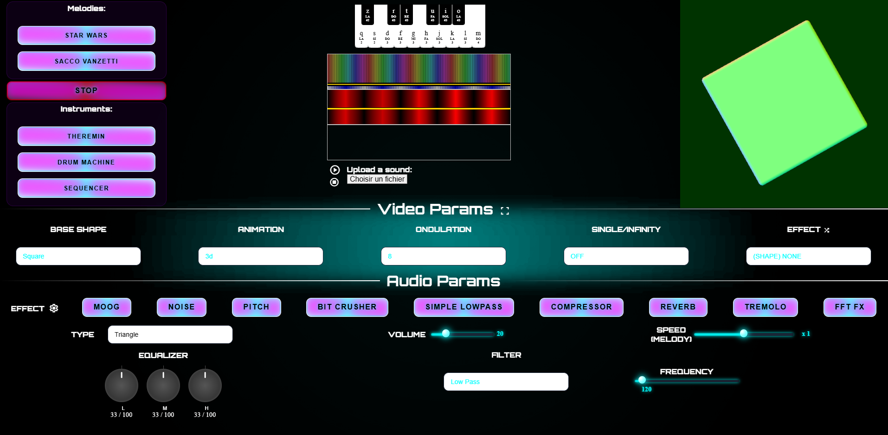

L'application utilise la **Web Audio API** pour analyser en temps réel le flux audio, qu'il provienne d'un fichier chargé (MP3/MP4/M4A1) ou du **synthétiseur/piano intégré**.

Ce flux est analysé pour extraire diverses informations (fréquences, amplitude, rythme, etc.), qui servent à piloter à la fois :
- Des **effets audio** modifiables en direct : filtres (passe-bas, passe-haut...), égaliseur, réverbération, distortion, etc.
- De **magnifiques visualisations 2D/3D** rendues avec **WebGL** et des shaders **GLSL**.

Les données audio sont converties en une texture dynamique qui alimente les shaders, permettant aux animations de réagir précisément à la musique.

Tous les paramètres sont ajustables par l'utilisateur (Intensité et type des effets audio, comportement des animations visuelles)

<p align="right">(<a href="#readme-top">back to top</a>)</p>

## Fonctionnalités
<a id="functionalities"></a>

### Partie Vidéo
<a id="part-video"></a>

Comme expliqué un peut plus haut, le son est transformé en une **texture2D** (une image) qui représente l'instant **T** de la variation du son, cette texture peut être utilisée en glsl (Web GL) afin de modifier en temps réels les vecteurs de l'animation graphique.

#### Fonctionnement général
<a id="fonctionnement"></a>

<div align="center">
Voici à quoi ressemble un exemple de cette texture à un instant T
</div>
<br/>
<div align="center">
    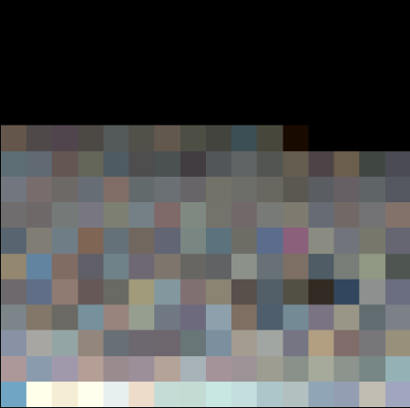
</div>

Initialement, le projet fonctionne sur des formes (shapes) que l'on peut changer et afficher en 3D et celles-ci varient en fonction de l'intensité du flux audio, il a été rajouté une coupe 2D afin également de déformer ondulairement les formes. On peut également pour le cas 3D, répéter l'affichage de la forme à l'infini

<div align="center">
Par exemple, voici une capture du Torus en 3D
</div>
<br/>
<div align="center">
    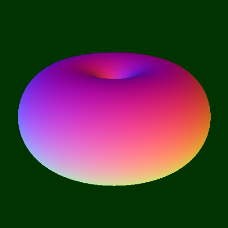
</div>

<div align="center">
Et de sa version 2D
</div>
<br/>
<div align="center">
    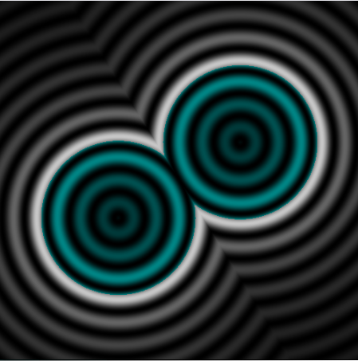
</div>

<div align="center">
Si un son est en cours, la figure se fait déformer par la texture2D citée plus haut et voici un exemple de sa déformation en 3D
</div>
<br/>
<div align="center">
    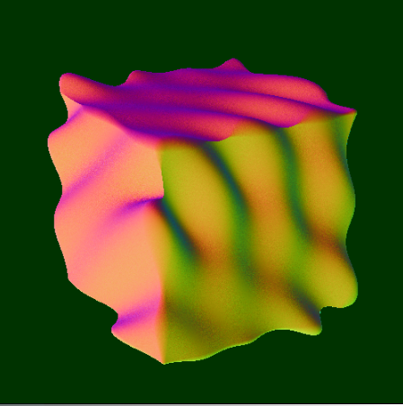
</div>


<div align="center">
Et de sa version 2D
</div>
<br/>
<div align="center">
    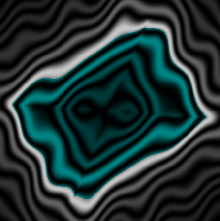
</div>


<div align="center">
On peut également démultiplier la figure à l'infini comme sur la capture ci-dessous:
</div>
<br/>
<div align="center">
    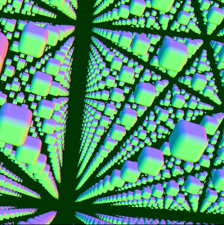
</div>


<div align="center">
On peut également ajouter un effet de twist sur les formes
</div>
<br/>
<div align="center">
    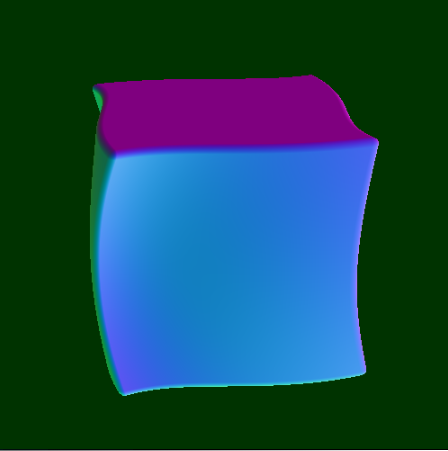
</div>

#### Les paramètres vidéo
<a id="video_params"></a>
Voici les différents paramètres possibles pour la partie vidéo

<div align="center">
    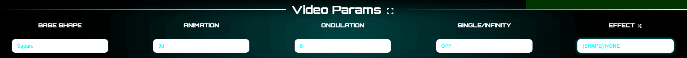
</div>

Les paramètres suivants sont disponibles:

1. **Base Shape** (*): Ce paramètre permet de choisir une forme géométrique (formes possibles: Carré, Petit carré, Tore, Petit tore, Hexagone, Cone et Cercle)
2. **Animation** (*): Ce paramètre permet de choisir si la forme est modélisée en 3D ou en 2D. Si l'option NONE est choisie, cela affiche la texture2D (image) générée par le son en temps réel qui permet d'altérer visuellement les animations.
3. **Ondulation** (*): Ce paramètre permet d'influer le niveau d'altération des formes en fonction du son, il a pour but de pouvoir déformer plus ou moins la forme géométrique
3. **Single/infinity** (*): Ce paramètre permet d'afficher une seule forme ou d'afficher une infinité de formes en copiant la matrice et la démultipliant à l'infini
4. **Effect**: les 4 premiers effets de ce paramètre sont des effets qui influent sur les formes (*), pour les reconnaitre, il est écrit (SHAPE) devant, ils permettent notament de déformer légèrement la forme géométrique. Les autres effets génèrent des animations qui ne sont plus basées sur les formes mais dont le visuel varie en fonction de la texture2D pour enjoliver le visuel graphique
5. **Type**: Ce paramètre remplace le paramètre Ondulation lorsque l'on n'est pas dans le cas d'une forme, il permet de modifier l'animation 3D ce qui la rend un peu paramétrable dans le but de produire des rendus visuels légèrement différents


Voici une petite vidéo qui vous montre tous les types d'animations possibles à leur état de base sans texture2D qui modifient le rendu visuel. 

https://github.com/user-attachments/assets/ea8c63dd-818e-44c1-a017-e59964816623


On peut lancer une génération d'animations aléatoires en cliquant sur la bouton juste à côté du titre effet dans le menu vidéo (voir capture) 

<div align="center">
    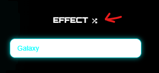
</div>

Celui-ci nous ouvre une popin listant toutes les animations et nous permettant de les sélectionner afin qu'elles soit dans une liste de lecture

<div align="center">
    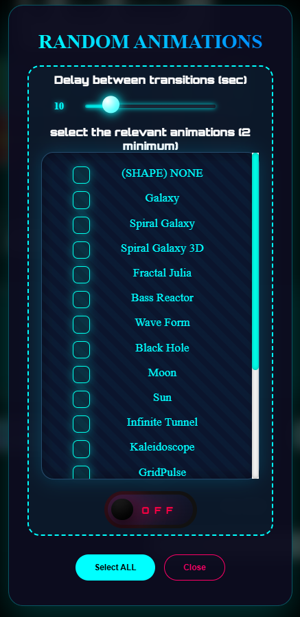
</div>

<p align="right">(<a href="#readme-top">back to top</a>)</p>

### Partie Audio
<a id="part-audio"></a>

#### Le synthé
<a id="synthe"></a>
Le synthé permet de générer notre flux audio, il fonctionne à l'aide d'oscillateur que l'API web audio nous founit et avec ceux ci nous pouvons jouer toutes les notes. On peut changer le type de l'onde afin d'en modifier sensiblement la tonalité ( Triangle, Sine, Square, Sawtooth )

Voici une petite vidéo afin de le présenter:
//TODO vidéo demo synthé

#### Les mélodies ou l'upload audio
<a id="melody"></a>
Pour générer notre flux audio, nous pouvons soit utiliser un les mélodies, soit charger directement un fichier son qui peut être au format mp3, mp4 ou m4a1. Corcernant les mélodie (les mélodies sont la simulation d'une partition lue et jouée automatiquement au synthé sans qu'il n'y ait besoin que l'humain joue vraiment). Deux melodies sont disponibles, la marche impériale de Star wars et la marche de sacco et vanzetti

<div align="center">
    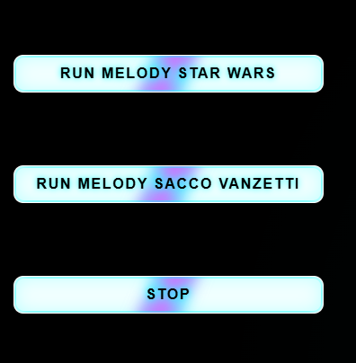
</div>

Sinon on peut upload un son

<div align="center">
    
</div>

Une fois le son uploadé, les  canvas s'animent, les deux premier concernent le son en temps réel et représentent l'amplitude. le graphe du bas représente le spectre du fichier uploadé

<div align="center">
    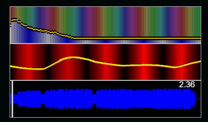
</div>


<p align="right">(<a href="#readme-top">back to top</a>)</p>

#### Les paramètres audio
<a id="audio-params"></a>

<div align="center">
    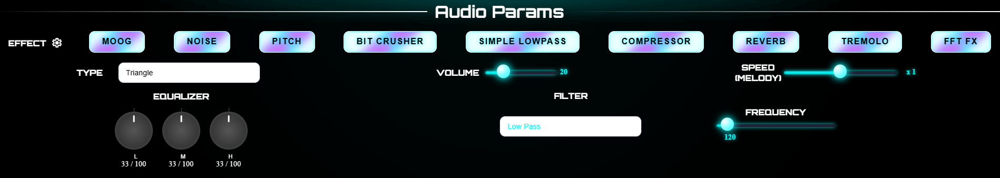
</div>

Concernant les paramètres audio, les paramètres suivants sont disponibles:

1. **Volume**: permet de monter ou diminuer le son (valeur comprise entre 0 et 100%)
2. **Equalizer**: permet de paramétrer manuellement la valeur des fréquences autorisées (high,mid et low) (valeur comprise entre 0 et 100% pour chaque type)
3. **Filtre**: permet de choisir le filtre utilisé, il est associé à une fréquence qui peut être modifiée (les différents filtres sont: Low Pass (120hz), High Pass (120hz), Band Pass (800hz), Low Shelf (180hz), High Shelf (6000hz), Peaking (1000hz), Notch (500hz) et All Pass (500hz))
4. **Effects**: permet d'activer 1 effet sur le son parmi la liste suivante: ( ceux ayant un astérisque peuvent être paramétrés )

    - **MOOG**: le filtre produit un son "crémeux" (creamy), gras et musical (utile avec le synthé ou certaines musique utilisant des synthés).

    - **NOISE** (*): le filtre produit l'ajout intentionnel d’un signal de bruit (noise) pour créer une texture sonore, enrichir un son ou produire un effet artistique.

    - **PITCH** (*): le filtre modifie le son qui devient plus aigu (pitch plus haut) ou plus grave (pitch plus bas) tout en gardant exactement la même longueur.

    - **BIT CRUSHER** (*): le filtre produit un effet audio numérique qui simule la dégradation sonore d’un signal audio en réduisant volontairement sa qualité, comme le faisaient les vieux équipements numériques à faible résolution (consoles 8-bit, samplers anciens, etc.).

    - **SIMPLE LOWPASS**: le filtre produit un effet audio qui laisse passer les basses fréquences (les graves) tout en atténuant ou en coupant les hautes fréquences (les aigus).

    - **COMPRESSOR** (*): le filtre produit un effet audio qui réduit automatiquement la dynamique d’un signal audio, c’est-à-dire l’écart entre les parties les plus faibles et les plus fortes.

    - **REVERB**: le filtre produit un effet audio qui simule la résonance naturelle d’un espace acoustique (comme une pièce, une salle, une cathédrale, une grotte, etc.).

    - **TREMOLO** (*): le filtre produit un effet audio qui consiste à moduler périodiquement le volume (amplitude) d’un signal sonore, créant une variation régulière de loudness (fort → faible → fort → faible…).

    - **FFT FX** (*): le filtre produit un effet audio basé sur la Fast Fourier Transform (Transformation de Fourier Rapide), une algorithmique mathématique qui décompose un signal audio temporel en ses composantes fréquentielles (spectre de fréquences)


5. **Speed Melody**: permet d'ajuster la vitesse des 2 mélodies pré enregistrée
6. **Type**: type de l'onde jouée par l'oscillateur ( Triangle, Sine, Square, Sawtooth ) ne concerne que les melodies et le synthé

Paramétrage avancé des effets:
<br/>
<div align="center">
    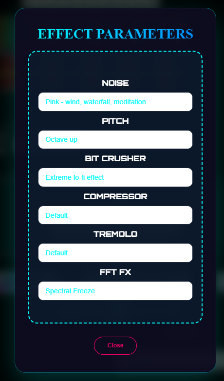
</div>
<br/>
Détails des paramètrages disponibles par effet:

- **NOISE**: 4 types de bruit ajoutés
    * Bruit blanc - fortes pluies, télévision brouillée
    * Bruit rose - vent, cascade, méditation
    * Bruit brun - tonnerre lointain, mer agitée
    * Bruit bleu - un jet d'air, un sifflement

- **PITCH**: 4 effets possibles:
    * Octave supérieure
    * Octave inférieure
    * Démon / robot
    * Choeur léger

- **BIT CRUSHER**: 2 effets possibles:
    * Super lisse sans fermeture
    * Effet lo-fi extrême

- **COMPRESSOR**: 5 effets possibles:
    * Défaut
    * Nivellement doux
    * Effet de glue bus de groupe
    * Drum squash
    * Limiteur transparent

- **TREMOLO**: 3 effets possibles:
    * Défaut
    * Panoramique automatique large et lent (0,33 Hz)
    * Onde carrée ultra-nerveuse de 8 Hz (style dub/techno)

- **FFT FX**: 3 effets possibles:
    * Gel spectral
    * Scintillement / Flou spectral
    * Modificateur de hauteur ±2 octaves préservant les formants

<p align="right">(<a href="#readme-top">back to top</a>)</p>

## Explication du code
<a id="codereview"></a>

### Partie Vidéo
<a id="code-video"></a>

Le fonctionnement principal se situe dans le fichier **webgl.js**

Le code est initialisé en chargeant la partie GLSL au début, tout objet 3D est traité en deux grandes étapes principales pour les shaders : les vertex shaders et les fragment shaders. Ce sont les deux programmes écrits en GLSL qui tournent directement sur la carte graphique (GPU).

```javascript
async function loadShaders() {
  vertexSource = await fetch('webgl/vertexSource.glsl').then(res => res.text());
  fragmentSource = await fetch('webgl/fragmentSource.glsl').then(res => res.text());
  fragmentSourceUserShader = await fetch('webgl/fragmentSourceUserShader.glsl').then(res => res.text());
}
```

Le fichier **fragmentSource.glsl** contient la fonction mainImage qui sera éxécutée pour afficher notre animation 3D. Celui importera en son sein le fichier  **fragmentSourceUserShader** qui contient le code de toutes les animations, celles que l'on aura sélectionné viendra surcharger le code de la fonction mainImage

le chargement des paramètres ainsi que du tableau de frequences du son audio que l'on transforme en temps réel se situe à ce niveau dans le code

```javascript
    dataTex = new THREE.DataTexture(arrayFreqToOpenGL, side, side, THREE.RGBAFormat);
	
	_uniforms = {
		iChannel0:			{ type: "t", value: dataTex },
		uIntEffect:			{ type: "i", value: effectToOpenGL},
		uIntInfinity:		{ type: "i", value: infinityToOpenGL},
		uIntFreq:			{ type: "i", value: freqToOpenGL },
		uIntType:			{ type: "i", value: typeToOpenGL },
		uIntTypeTexture:	{ type: "i", value: typeTextureToOpenGL },
		iGlobalTime:    	{ type: "f", value: 1.0 },
		iResolution: 		{ type: "v3", value: new THREE.Vector3() },
		iMouse: 			{ type: 'v4', value: new THREE.Vector2() },
	}
```

Concernant les interractions de la souris avec le canvas d'animation 3D, les fonctions qui gèrent ces évènement se situent également dans le fichier webgl.js (utile si l'on veut en ajouter ou réaliser des modifications sur celles-ci)

```javascript
    //mouse effect management
	document.getElementById("shaderPixelAnim").appendChild(renderer.domElement);
	canvasClicked = false;
	renderer.domElement.addEventListener('mousemove', function(e) {
		if(canvasClicked == true){
			var canvas = renderer.domElement;
			var rect = canvas.getBoundingClientRect();
			mesh.material.uniforms.iMouse.value.x = -parseFloat((e.clientX - rect.left));
			mesh.material.uniforms.iMouse.value.y = -parseFloat((e.clientY - rect.top));
		}
	});
	renderer.domElement.addEventListener('mousedown', function(e) {
			var canvas = renderer.domElement;
			var rect = canvas.getBoundingClientRect();
			mesh.material.uniforms.iMouse.value.x = -parseFloat((e.clientX - rect.left));
			mesh.material.uniforms.iMouse.value.y = -parseFloat((e.clientY - rect.top));
			canvasClicked = true;
	});
	renderer.domElement.addEventListener('mouseup', function(e) {
		canvasClicked = false;
		var canvas = renderer.domElement;
		var rect = canvas.getBoundingClientRect();
		mesh.material.uniforms.iMouse.value.z = parseFloat((e.clientX - rect.left));
		mesh.material.uniforms.iMouse.value.w = parseFloat((e.clientY - rect.top));
	});
	renderer.domElement.addEventListener('wheel', function(e) {
		canvasClicked = false;
		if(e.wheelDelta > 0) {
			mesh.material.uniforms.iResolution.value.x = mesh.material.uniforms.iResolution.value.x + 50;
		} else {
			mesh.material.uniforms.iResolution.value.x = mesh.material.uniforms.iResolution.value.x - 50;
		}
	});
```


Maintenant je vais expliquer comment en pratique prendre une animation GLSL et comment dans le code GLSL récupérer la texture2D qui va nous permettre de créer des modification de vecteurs qui nous permettront de réaliser nos animations en fonction du son

Tout d'abord il faut récupérer la texture2D qui est générée en temps réel en fonction du tableau de fréquences:

```glsl
vec4 fragColorTexture = texture2D(iChannel0, iResolution.xy);
```

A titre informatif, on peut accéder soit à la position du vecteur de texture généré via les champs x, y et z (exemple: fragColorTexture.xy), soit également à leur couleur RGB via les champs r, g et b (exemple: fragColorTexture.rgb)

Ensuite il faut trouver l'endroit de l'animation qui nous interesse et à l'aide des informations que la texture nous envoit, réaliser des opérations qui altèrent notre animation ( de préférence de manière harmonieuse )

On peut par exemple utiliser la fonction mix est une des fonctions les plus utiles et utilisées en GLSL (le langage des shaders dans WebGL, Three.js, OpenGL, etc.). Elle permet de faire une interpolation linéaire entre deux valeurs.

```glsl
    fragColor = mix(color, vec3(0.5), fragColorTexture.xyz);
```

On peut également utiliser la fonction smoothstep en GLSL (utilisée dans Three.js, WebGL, shaders en général) qui permet de créer des transitions douces (smooth transitions) entre deux valeurs. Elle est parfaite pour les animations fluides, les masques progressifs, les effets de fondu, etc.

```glsl
    fragColor = smoothstep(color, vec3(0.5), fragColorTexture.xyz);
```

Mais attention au problème d'antialising qui peut faire buguer la partie gauche de l'animation ou créer des bords en escalier très visibles et peu esthétiques après un smoothstep, mais pas d'inquiétude, on peut le solutionner ainsi!

```glsl
    // l'operation que l'on souhaite réaliser
    vec3 values = vec3(min(1.0,fragColorTexture.x), min(0.2,fragColorTexture.y), min(0.8,fragColorTexture.z));
    // Avec anti-aliasing adaptatif
    vec3 aa = fwidth(values);                         // vec3 avec fwidth par composante
    vec3 smooth = smoothstep(-aa, aa, values);
    col *=  smooth; 
```

On peut également modifier l'application simplement en modifiant un nombre flottant, ou en faisant une multiplication de vecteurs, par exemple:

```glsl
    // modifier un flottant
    float dist = 0.5 + (fragColorTexture.x * 25.0);
    //multiplication de vecteurs
    vec3 fragColor = color * fragColorTexture.xyz;
```

<p align="right">(<a href="#readme-top">back to top</a>)</p>

### Partie Audio
<a id="code-audio"></a>

Le fonctionnement principal se situe dans le fichier webaudio.js

#### Initialisation du audioContext
<a id="code-init-audio-context"></a>
Tout d'abord il nous faut initialiser le context webaudio, car depuis plusieurs années (Chrome 66+, puis tous les navigateurs), les politiques autoplay des navigateurs bloquent la lecture audio automatique pour éviter les pubs sonores intrusives, l’AudioContext est souvent créé en état suspended (suspendu) si pas initié directement par une interaction utilisateur (comme un clic ou touch)

```javascript
// Fonction à appeler sur le premier clic/touch de l’utilisateur
async function unlockAudio() {
    if (isUnlocked) return;

    // Crée ou reprend l’AudioContext
    audioCtx = new AudioContext();

	// Start when user clicks or after resume (required on most browsers)
	document.documentElement.addEventListener('click', () => {
		if (audioCtx.state === 'suspended') audioCtx.resume();
		initAudio().then(() => {
			console.log("AudioContext débloqué et prêt !");
			isUnlocked = true;

			// Mets ici tout ce qui a besoin du son
			initAudioContext2();
		});

	}, { once: true });

    // Nettoyage : on ne veut appeler ça qu’une seule fois
    document.removeEventListener('click', unlockAudio);
    document.removeEventListener('touchstart', unlockAudio);
    document.removeEventListener('keydown', unlockAudio);
}
```

Une fois notre audioContext actif, on peut charger tous les modules qui nous seront nécessaires lors de la future création de notre graphe audio,
ces audioWorklet Processor nous permettent de remplacer les javascriptNodes obsolètes et d'avoir un code spécifique par effet audio que l'on pourra utiliser dans nos modifications du flux audio

```javascript
async function initAudio() {
    try {
      // This MUST be awaited and inside try/catch
      console.log("Loading processor...");
      await audioCtx.audioWorklet.addModule('./audio-worklet-processor.js');
      console.log("Processor (my-audio-processor) loaded successfully");

	  await audioCtx.audioWorklet.addModule('./effect/simple-lowpass.js');
	  console.log("Processor (simple-lowpass-effect) loaded successfully");

	  await audioCtx.audioWorklet.addModule('./effect/bit-crusher.js');
	  console.log("Processor (bit-crusher-effect) loaded successfully");

	  await audioCtx.audioWorklet.addModule('./effect/pink.js');
	  console.log("Processor (pink-effect) loaded successfully");

	  await audioCtx.audioWorklet.addModule('./effect/noise.js');
	  console.log("Processor (noise-effect) loaded successfully");

	  await audioCtx.audioWorklet.addModule('./effect/pitch.js');
	  console.log("Processor (pitch) loaded successfully");

	  await audioCtx.audioWorklet.addModule('./effect/compressor.js');
	  console.log("Processor (compressor) loaded successfully");

	  await audioCtx.audioWorklet.addModule('./effect/reverb.js');
	  console.log("Processor (reverb) loaded successfully");

	  await audioCtx.audioWorklet.addModule('./effect/tremolo.js');
	  console.log("Processor (tremolo) loaded successfully");

	  await audioCtx.audioWorklet.addModule('./effect/fft-fx.js');
	  console.log("Processor (fft-fx) loaded successfully");

      // Only now is it safe to create the node
      analyserNode = new AudioWorkletNode(audioCtx, 'my-audio-processor');
      console.log("AudioWorkletNode created and connected (my-audio-processor)");


	  // effects
	  simplePassEffectNode = new AudioWorkletNode(audioCtx, 'simple-lowpass', {
		parameterData: { cutoff: 800 }
	  });
	  console.log("AudioWorkletNode created and connected (simple-lowpass-effect-processor)");

	  bitCrusherEffectNode = new AudioWorkletNode(audioCtx, 'bitcrusher', {
		outputChannelCount: [2]
	  });

	  bitCrusherEffectNode.parameters.get('bitDepth').setValueAtTime(16, audioCtx.currentTime);
	  bitCrusherEffectNode.parameters.get('bitDepth').linearRampToValueAtTime(4, audioCtx.currentTime + 2);
	  console.log("AudioWorkletNode created and connected (bit-crusher-effect-processor)");

	  pinkEffectNode = new AudioWorkletNode(audioCtx, 'pink-noise-filtered');
	  pinkEffectNode.parameters.get('cutoff').linearRampToValueAtTime(200, audioCtx.currentTime + 5);
	  console.log("AudioWorkletNode created and connected (pink-effect-processor)");

	  pitchEffectNode = new AudioWorkletNode(audioCtx, 'pitch');
	  pitchEffectNode.parameters.get('pitch').setValueAtTime(2, audioCtx.currentTime);

	  console.log("AudioWorkletNode created and connected (pitch-effect-processor)");

	  noiseEffectNode = new AudioWorkletNode(audioCtx, 'noise');
	  noiseEffectNode.parameters.get('type').setValueAtTime(1, 0);        // pink
	  console.log("AudioWorkletNode created and connected (noise-effect-processor)");

	  compressorEffectNode = new AudioWorkletNode(audioCtx, 'compressor', {
		processorOptions: { channelCount: 2 }
	  });

	  compressorEffectNode.parameters.get('threshold').value = -24;
	  compressorEffectNode.parameters.get('ratio').value = 4;
	  compressorEffectNode.parameters.get('attack').value = 8;
	  compressorEffectNode.parameters.get('release').value = 120;
	  compressorEffectNode.parameters.get('makeup').value = 6;
	  compressorEffectNode.parameters.get('mix').value = 100;
	  console.log("AudioWorkletNode created and connected (compressor-effect-processor)");

	  reverbEffectNode = new AudioWorkletNode(audioCtx, 'reverb', {
		outputChannelCount: [2]
	  });

	  // Exemple de contrôle
  	  reverbEffectNode.parameters.get('roomSize').setValueAtTime(0.85, audioCtx.currentTime);
  	  reverbEffectNode.parameters.get('damping').setValueAtTime(0.3, audioCtx.currentTime);
  	  reverbEffectNode.parameters.get('wet').setValueAtTime(0.4, audioCtx.currentTime);
  	  reverbEffectNode.parameters.get('freeze').setValueAtTime(1, audioCtx.currentTime + 5); // freeze après 5s
	  console.log("AudioWorkletNode created and connected (reverb-effect-processor)");

	  tremoloEffectNode = new AudioWorkletNode(audioCtx, 'tremolo', {
		  outputChannelCount: [2],           // indispensable
		  channelCount: 2,                   // force 2 canaux en sortie
		  channelCountMode: 'explicit',
		  channelInterpretation: 'speakers'
	  });

	  // 3. Carré 8 Hz ultra-nerveux (style dub/techno)
	  tremoloEffectNode.parameters.get('rate').setValueAtTime(8, audioCtx.currentTime);
	  tremoloEffectNode.parameters.get('shape').setValueAtTime(2, audioCtx.currentTime);
	  tremoloEffectNode.parameters.get('smooth').setValueAtTime(0.7, audioCtx.currentTime); // adoucit le carré
	  console.log("AudioWorkletNode created and connected (tremolo-effect-processor)");

	fftFxEffectNode = new AudioWorkletNode(audioCtx, 'fft-fx');
	fftFxEffectNode.parameters.get('mode').setValueAtTime(0, audioCtx.currentTime);
	fftFxEffectNode.parameters.get('freeze').setValueAtTime(1, audioCtx.currentTime + 2); // pad infini !

console.log("AudioWorkletNode created and connected (fft-fx-effect-processor)");
    } catch (err) {
      console.error("Failed to load AudioWorklet module:", err);
      // This is where you’ll see the real error (syntax, 404, CORS, etc.)
    }
}
```

On peut enfin initialiser tous les composants nécéssaires à la construction de notre graphe audio

```javascript
function initAudioContext2(){
	try{
		
		//We connect the sound's node
		gainNode = audioCtx.createGain();
		gainNode.gain.value = (20/100) * (20/100);
		
		//sound equalizer
		hBand = audioCtx.createBiquadFilter();
		lBand = audioCtx.createBiquadFilter();	
		lGain = audioCtx.createGain();
		mGain = audioCtx.createGain();
		hGain = audioCtx.createGain();
		
		//filter
		filter = audioCtx.createBiquadFilter();
		
		//We create a node to analyze as well as a javascript node
		analyser = audioCtx.createAnalyser();
			
		//Creation of oscillators
		oscillator = audioCtx.createOscillator();
		oscillator1 = audioCtx.createOscillator();
		oscillator2 = audioCtx.createOscillator();
		oscillator0 = audioCtx.createOscillator();
		
		oscillator.start(0);
		oscillator1.start(0);
		oscillator2.start(0);
		oscillator0.start(0);
		
		var cpt = 0;
		for (key in tabKeyNotes) {
			oscillatorTab[cpt] = audioCtx.createOscillator();
			oscillatorTab[cpt].start(0);
			cpt++;
		}

		buidGraph();
		setDefaultValues();
		
	}catch(e){
		alert('Web Audio API is not supported in this browser');
	}
}
```

On construit enfin notre graphe audio, en paramétrant nos noeuds de l'égaliseur, le noeud de gain qui gère le volume, notre noeud de filtre ainsi qu'a notre noeud d'analyse. On dessine à ce moment nos deux courbes et enfin on se connect au noeud de destination afin de finaliser ce build

```javascript
function buidGraph(){
		/** PARAM EGALISEUR **/
		hBand.type = "lowshelf";
		hBand.frequency.value = bandSplit[0];
		hBand.gain.value = gainDb;

		lBand.type = "highshelf";
		lBand.frequency.value = bandSplit[1];
		lBand.gain.value = gainDb;
		lBand.connect(lGain);
		hBand.connect(hGain);

		// Connect the sound sample to its volume node
		lGain.connect(gainNode);
		mGain.connect(gainNode);
		hGain.connect(gainNode);

		/** END PARAM EGALISEUR **/
		gainNode.connect(filter);
		
		filter.connect(analyserNode);	
		analyserNode.connect(analyser);

		function draw1() {
			draw(analyser);
			requestAnimationFrame(draw1);
		}
		draw1();

		function draw2() {
			drawWave(analyser);
			requestAnimationFrame(draw2);
		}
		draw2();
		
		analyserNode.connect(audioCtx.destination);	

		let frontCanvasTimeline = document.getElementById("spectreTimelineMP3");
		frontCanvasTimeline.addEventListener("mousedown", function(event) {
			console.log("mouse click on canvas, let's jump to another position in the song")
			var mousePos = getMousePos(frontCanvasTimeline, event);
			// will compute time from mouse pos and start playing from there...
			jumpTo(mousePos);
		})
}
```

Voici la capture de notre graphe webAudio déssiné mais simplifié (je n'ai pas mis tous les AudioWorkletNode car il y a énormément d'effets ainsi que pas affiché tous les oscillatorNode car il en existe 1 par touche présente sur le synthé et cela prendrai beaucoup trop d'espace sur le graphe)

<div align="center">
    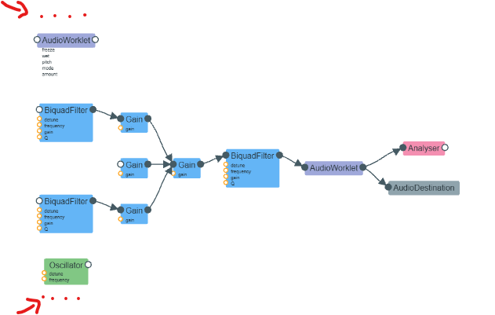
</div>

Notre graphe étant enfin terminé, notre application est opérationnelle! On remarque que l'on a deux fonctions draw qui se sont exécutées permettant de dessiner nos courbes en temps réel. Il est  à noter un point important, c'est dans la méthode **draw** que nous obtenons le tableau de fréquence que nous envoyons en temps réel à la partie vidéo 3D

```javascript
    if(analyser.frequencyBinCount){
		frequencyData = new Uint8Array(analyser.frequencyBinCount);
		analyser.getByteFrequencyData(frequencyData);
	} 

	..........

	arrayFreqToOpenGL = frequencyData;
```


Le code du process utilisé afin de charger un fichier audio (mp3, mp4, m4a1) via un champs input type file. Une fois le fichier envoyé vie le champs input, on decode le contexte audio et on crée le noeud source, ensuite on connecte ce noeud source à notre graphe audio, on dessine son spectre puis on lance la musique en faisant source.start()

```javascript
function loadInputSound(element) {
	
	loadAudio(element.files[0]);
	if(isUnlocked) document.getElementById("currentMp3").innerHTML = element.files[0].name;

	// Method 1: Create a completely new input (recommended)
	element.type = 'text';  // temporary change
	element.type = 'file';  // back to file – this clears it

}

async function loadAudio(file) {
	try {
	  // Load an audio file
	  // Decode it
	  audioCtx.decodeAudioData(await file.arrayBuffer(), playBuffer);
	} catch (err) {
	  console.error(`Unable to fetch the audio file. Error: ${err.message}`);
	}
}

soundMP3_is_loaded = false;

var mp3Buffer;
var source;

function playBuffer(buffer) {

	if(!isUnlocked) {
		openPopin();
		return;
	}
	
	safeDisconnect(source);
	source = audioCtx.createBufferSource();
	source.buffer = buffer;
	mp3Buffer = buffer;
	drawTrack(buffer,1,0);
	source.connect(lBand);
	source.connect(hBand);
	source.connect(mGain);
	source.connect(gainNode);

	source.loop = true;
	source.start();
	paused = false;
	restartMp3IconColor();

	lastTime = audioCtx.currentTime;

	soundMP3_is_loaded = true;
	elapsedTimeSinceStart = 0;
	animateTime();

	// Optional: configure
	source.loop = true;

	// Add ended handler (optional but recommended)
	source.onended = () => {
		source.disconnect(); // clean up
		source.buffer = null; // aide le garbage collector
	};
}
```

<p align="right">(<a href="#readme-top">back to top</a>)</p>

#### Code du synthétiseur
<a id="code-synthe"></a>

Concernant le synthé, il est généré via le code javascript

```javascript
    /**PART binding keys of keyboard **/
    var tabNoteInfo = ['LA<br>2','LA<br>#2','SI<br>2','DO<br>3','DO<br>#3','RE<br>3','RE<br>#3','MI<br>3','FA<br>3','FA<br>#3','SOL<br>3','SOL<br>#3','LA<br>3','LA<br>#3','SI<br>3','DO<br>4'];
    var tabTouches = ['q','z','s','d','r','f','t','g','h','u','j','i','k','o','l','m'];
    var tabTouchesBool = [false,false,false,false,false,false,false,false,false,false,false,false,false,false,false,false];
    //TODO to erase (mini note test table) #testNote //!\\ onclick events work with a delay, not like keys
    var strTestNote = "<table><tr><td class='topPiano' id='topPiano0'>&nbsp;</td><td class='topPiano' id='topPiano2'>&nbsp;</td><td class='topPiano' id='topPiano3'>&nbsp;</td><td class='topPiano' id='topPiano5'>&nbsp;</td><td class='topPiano' id='topPiano7'>&nbsp;</td><td class='topPiano' id='topPiano8'>&nbsp;</td><td class='topPiano' id='topPiano10'>&nbsp;</td><td class='topPiano' id='topPiano12'>&nbsp;</td><td class='topPiano' id='topPiano14'>&nbsp;</td><td class='topPiano' id='topPiano15'>&nbsp;</td></tr><tr>";
    var strTestNoteDiese = "<table><tr>";
    for(var j=0; j<tabFrequences.length; j++){
        if(j !== 1 && j !== 4 && j !== 6 && j !== 9 && j !== 11 && j !== 13){
            strTestNote = strTestNote + "<td class='testNoteTD' id='testNoteTD"+j+"' onmousedown='play("+j+",false)' onmouseup='stop("+j+",false)' onmouseover='setPianoHover(" + j + ",1,true);' onmouseout='setPianoHover(" + j + ",1,false);'>" + tabTouches[j] + "<p class='pPiano'>" + tabNoteInfo[j] + "</p></td>";
        }else{
            strTestNoteDiese = strTestNoteDiese + "<td class='testNoteDieseTD' id='testNoteDieseTD"+j+"'  onmousedown='play("+j+",false)' onmouseup='stop("+j+",false);this.style.backgroundColor=\"black\"' onmouseover='setPianoHover(" + j + ",0,true);' onmouseout='setPianoHover(" + j + ",0,false);'>" + tabTouches[j] + "<p class='pPiano'>" + tabNoteInfo[j] + "</p></td>";
            if(j == 1 || j == 6) strTestNoteDiese = strTestNoteDiese + "<td class='testNoteDieseTDBlank'></td>";
        }
    }
    strTestNote = strTestNote + "</tr></table>";
    strTestNoteDiese = strTestNoteDiese + "</tr></table>";
```

Ensuite une fois qu'il est crée au niveau de la vue, on peut jouer une note simplement en lançant cette méthode

```javascript
    function playNoteKeyboard(freq){
        if(tabTouchesBool[freq] == false){
            noteToPlay = new SoundK(tabFrequences[freq], tabType[type], freq);
            tabTouchesBool[freq] = true;
        }
    }
```

<p align="right">(<a href="#readme-top">back to top</a>)</p>

#### Code des mélodies
<a id="code-melody"></a>

Les mélodies sont des successions de notes jouées selon un certain tempo, le code associé est simplement composé de plusieurs tableaux qui nous font jouer la partition selon le tempo grâce à des settimeout

```javascript
    var notesAjouerStarWarsL1 = ["fa","fa","fa","la#","fa++","re#+","re+","do+","la#+","fa+","re#+","re+","do+","la#+","fa+","re#+","re+","re#+"];
    var notesAjouerStarWarsL2 = ["do+.","fa","fa","fa","do+","soupir","fa","fa","sol.","sol","re#+","re+","do+","la#+","la#+","do+","re+","do+","sol","la","fa","fa"];
    var notesAjouerStarWarsL3 = ["sol.","sol","re#+","re+","do+","la#+","fa+","fa","fa","fa","sol.","sol","re#+","re+","do+","la#+"];
    var notesAjouerStarWarsL4 = ["la#+","do+","re+","do+","sol","la","fa.","fa","la#+.","sol#+","fa#+.","fa+","re#+.","do#+","do+.","la#+","do+.","fa","fa","fa"];
    var beatsStarWarsL1 = [4,4,4,16,8,4,4,4,16,8,4,4,4,16,8,4,4,4];
    var beatsStarWarsL2 = [16,4,4,4,16,8,4,4,8,4,4,4,4,4,4,2,2,4,4,8,4,4];
    var beatsStarWarsL3 = [8,4,4,4,4,4,16,8,4,4,8,4,4,4,4,4];
    var beatsStarWarsL4 = [4,2,2,4,4,8,4,2,4,2,4,2,4,2,4,2,16,4,4,4];
    var noteNamesStarWars = ['do','do#','re','re#','mi','fa','fa#','sol','sol#','la','la#','si']
    var tonesStarWars = [261.626,277.183,293.665,311.127,329.628,349.228,369.994,391.995,415.305,440,466.164,493.883];
    var noteNamesTxt = ['3','4','5','6','7','8','9','10','11','12','13','14'];

    notesAjouerStarWars = notesAjouerStarWarsL1.concat(notesAjouerStarWarsL2).concat(notesAjouerStarWarsL3).concat(notesAjouerStarWarsL4);
    beatsStarWars = beatsStarWarsL1.concat(beatsStarWarsL2).concat(beatsStarWarsL3).concat(beatsStarWarsL4);

    //notesAjouerStarWars = notesAjouerStarWarsL4;
    //beatsStarWars = beatsStarWarsL4;
    tonesStarWars = divideBy2(tonesStarWars);

    function reverseDiese(){
        for(var i=0; i<noteNamesStarWars.length; i++){
            if(noteNamesStarWars[i].indexOf("#") >= 0){
                var tmpNote = noteNamesStarWars[i];
                noteNamesStarWars[i] = noteNamesStarWars[i-1];
                noteNamesStarWars[i-1] = tmpNote;
                var tmpFreq = tonesStarWars[i];
                tonesStarWars[i] = tonesStarWars[i-1];
                tonesStarWars[i-1] = tmpFreq;
            }
        }
    }

    reverseDiese();
```

```javascript
    notePlayed0 = false;
    var finish0 = true;
    function runMelodieStarWars(i,j){
        
        var beat;
        finish0 = false;
        
        if(notePlayed0 == false && stopMelodie2 == false){

            var tempo;
            var notePlayedForHover = -1;
            
            if(i==j){

                for (var k = 0; k < noteNamesStarWars.length; k++) {
                    
                    if(notesAjouerStarWars[i].indexOf(noteNamesStarWars[k]) >= 0){
                        
                        var freqToPlay = tonesStarWars[k];
                        if(notesAjouerStarWars[i].indexOf("+") >= 0) freqToPlay = freqToPlay*2;
                        if(notesAjouerStarWars[i].indexOf("-") >= 0) freqToPlay = freqToPlay/2;
                        noteToPlay = new Sound0(freqToPlay, tabType[type]);
                        beat = tabMelodieDureeNoteStarWars[i];
                        if(notesAjouerStarWars[i].indexOf(".") >= 0) beat = beat*1.5;
                        
                        
                        notePlayedForHover = noteNamesTxt[k];
                        //console.log(notesAjouerStarWars[i]+" freq:"+freqToPlay+" beat="+beat);
                        break;
                    }
                    
                }
                
                if(notesAjouerStarWars[i] == "soupir"){
                    beat = 1;
                }

                play0(notePlayedForHover);
                tempo = dureeNote2*beat;
            }else{
                tempo = 10;
            }

            setTimeout(function(){
                
                if(i==notesAjouerStarWars.length-1){
                    runMelodieStarWars(0,0);
                }else{
                    if(i==j){
                        stop0(notePlayedForHover);

                        finish0 = true;
                        
                        //we move on to the next musical note
                        if(i<notesAjouerStarWars.length-1) runMelodieStarWars(i+1,j);
                    }else{
                        //we play time out
                        runMelodieStarWars(i,j+1);
                    }
                }
                
                //if(i==notesAjouerStarWars.length-1) runMelodieStarWars(0,0);
            
            }, tempo);
        }
    }
```

<p align="right">(<a href="#readme-top">back to top</a>)</p>

#### Code des paramètres/effets audio
<a id="code-audio-params"></a>

Concernant les paramètres, soit ils sont nativement gérés par les composants existants de l'API web audio. Par exemple prenons le cas du volume qui fonctionne sur le noeud de gain, les mises à jours de sa valeur sont réalisées via un input qui met à jour sa valeur dès que la valeur de l'input change.

```javascript
    //Manage volume
    function changeVolume(element){
        var volume = element.value;
        var fraction = parseInt(element.value) / parseInt(element.max);
        gainNode.gain.value = fraction * fraction;
    }
```

Sinon il existe d'autre paramètres qui sont codés via des AudioWorkletNode, ce sont nos propres noeuds codés nous permettant de réaliser nos propres paramètres tel que des filtres personnalisés, divers effets. Dans ces cas là nous devont écrire l'intégralité du composant. Par exemple dans l'application, je vais vous exposer comment j'ai créé mon propre effet noise (bruit)

```javascript
// White, Pink, Brownian, Blue, Violet + filtre passe-bas premier ordre contrôlable
class NoiseProcessor extends AudioWorkletProcessor {
  static get parameterDescriptors() {
    return [
      {
        name: 'type',           // 0=white, 1=pink, 2=brown, 3=blue, 4=violet
        defaultValue: 1,
        minValue: 0,
        maxValue: 4,
        automationRate: 'a-rate'
      },
      {
        name: 'cutoff',         // fréquence de coupure du filtre passe-bas (Hz), 0 = pas de filtre
        defaultValue: 800,
        minValue: 0,
        maxValue: 22050,        // un peu au-dessus de Nyquist
        automationRate: 'a-rate'
      },
      {
        name: 'gain',
        defaultValue: 0.25,     // niveau de sortie global
        minValue: 0,
        maxValue: 1,
        automationRate: 'a-rate'
      }
    ];
  }

  constructor() {
    super();
    
    // État pour chaque type de bruit
    this.pinkB0 = this.pinkB1 = this.pinkB2 = this.pinkB3 = this.pinkB4 = this.pinkB5 = this.pinkB6 = 0;
    this.brown = 0;
    
    // Pour blue (+3 dB/oct) : simple différentiateur
    this.lastWhite = 0;
    
    // Pour violet (+6 dB/oct) : seconde différence
    this.whiteM1 = 0;
    this.whiteM2 = 0;
    
    // Filtre passe-bas 1er ordre (exponentiel moving average)
    this.z = 0;
    
    // Dernière valeur de cutoff pour détecter les changements
    this.lastCutoff = 0;
  }

  process(inputs, outputs, parameters) {
    const output = outputs[0];
    const typeParam = parameters.type;
    const cutoffParam = parameters.cutoff;
    const gainParam = parameters.gain;
    const applyFilter = cutoffParam[0] > 20; // on ignore les très basses fréquences

    for (let channel = 0; channel < output.length; ++channel) {
      const out = output[channel];

      for (let i = 0; i < out.length; ++i) {
        // Récupération des paramètres (a-rate support)
        const type = Math.round(typeParam.length > 1 ? typeParam[i] : typeParam[0]) | 0;
        const cutoff = cutoffParam.length > 1 ? cutoffParam[i] : cutoffParam[0];
        const gain = gainParam.length > 1 ? gainParam[i] : gainParam[0];

        let noise = Math.random() * 2 - 1; // bruit blanc [-1, 1]

        switch (type) {
          case 0: // White - rien à faire
            break;

          case 1: // Pink - méthode Voss (7 accumulateurs)
            this.pinkB0 = this.pinkB0 * 0.99886 + noise * 0.055;
            this.pinkB1 = this.pinkB1 * 0.99332 + noise * 0.075;
            this.pinkB2 = this.pinkB2 * 0.96900 + noise * 0.153;
            this.pinkB3 = this.pinkB3 * 0.86650 + noise * 0.310;
            this.pinkB4 = this.pinkB4 * 0.55000 + noise * 0.532;
            this.pinkB5 = this.pinkB5 * 0.31000 + noise * 0.775;
            this.pinkB6 = this.pinkB6 * 0.11500 + noise * 0.923;
            
            noise = (this.pinkB0 + this.pinkB1 + this.pinkB2 + this.pinkB3 +
                     this.pinkB4 + this.pinkB5 + this.pinkB6 + noise * 0.125) * 0.125;
            break;

          case 2: // Brownian (Brown / Red)
            this.brown += noise * 0.02;
            this.brown *= 0.99;
            noise = this.brown;
            break;

          case 3: // Blue - différentiateur simple
            noise = noise - this.lastWhite;
            this.lastWhite = noise * 0.5 + this.lastWhite * 0.5; // léger lissage pour éviter l'explosion
            noise *= 4.0; // compensation de gain
            break;

          case 4: // Violet - seconde différence
            const secondDiff = noise - 2 * this.whiteM1 + this.whiteM2;
            this.whiteM2 = this.whiteM1;
            this.whiteM1 = noise;
            noise = secondDiff * 8.0; // compensation de gain
            break;
        }

        // Filtre passe-bas 1er ordre (si cutoff > 20 Hz)
        if (applyFilter && cutoff > 20) {
          const normalizedCutoff = Math.min(cutoff / (sampleRate * 0.5), 0.99);
          const alpha = normalizedCutoff < 0.001 ? 0.001 : 1 - Math.exp(-2 * Math.PI * normalizedCutoff * 0.1);
          
          this.z += alpha * (noise - this.z);
          noise = this.z;
        }

        out[i] = noise * gain;
      }
    }

    return true;
  }
}

registerProcessor('noise', NoiseProcessor);
```

Comme vous pouvez le voir, on crée une classe NoiseProcessor qui extends AudioWorkletProcessor, au début on a une méthode get **parameterDescriptors()** qui permet de déclarer des paramètres automatisables personnalisés (AudioParam) pour notre AudioWorkletNode.

Ensuite nous avons une fonction **process(inputs, outputs, parameters)**, c'est elle qui traite le son en temps réel, bloc par bloc. Elle prend en entrée 3 paramètres, tout d'abords les inputs qui est le tableau d'entrées audio, ensuite les outputs qui est le tableau de sorties audio (C'est ici que vous écrivez le son traité). Enfin la partie que l'on va souvent devoir adapter, le paramètre parameters qui représente l'Objet contenant les valeurs des AudioParam personnalisés déclarés via parameterDescriptors() dont je parlais plus haut. Dans l'exemple du Noise, on voit que l'on a 3 paramètres (le type, le cutoff et le gain). ensuite nous codons notre effet et si on a plusieurs paramètres, on fait un switch case afin de gérer nos différents cas. 

<p align="right">(<a href="#readme-top">back to top</a>)</p>

## License
<a id="license"></a>
C’est **open source ET gratuit**. Pas de piège, pas de version premium cachée, pas d’abonnement surprise. Juste du code libre pour des humains libres. 

<p align="right">(<a href="#readme-top">back to top</a>)</p>

## Contact
<a id="contact"></a>
Informations de contact:

**Nom**: Porta <br/>
**Prénom**: Benjamin <br/>
**Pays**: FRANCE <br/>
**Ville**: Nice <br/>
**Mail**: pb402385@gmail.com <br/>
**Github**: https://github.com/pb402385

<p align="right">(<a href="#readme-top">back to top</a>)</p>

## Remerciements
<a id="acknowledgments"></a>

Tout d'abord, je souhaite remercier mon pote **Klem** qui m'a initié au web GL il y à plusieurs années et sans qui il ne me serait jamais venu à l'idée de combiner du web GL à du web audio.
Concernant la partie web audio, je remercie mon professeur de Master **Michel Buffa** qui m'a fait connaitre le web audio durant mes études.

Maintenant je souhaiterai remercier les développeurs a qui j'ai pu emprunter du code web GL sur Shadertoy (https://www.shadertoy.com/)

* Remerciement à **BigWIngs** de qui j'ai pu récupérer l'animation **Trou Noir** dont le lien original de l'animation se situe à l'addresse suivante: https://www.shadertoy.com/view/3d2SWK
* Remerciement à **Inigo Quilez** de qui j'ai pu récupérer l'animation **3D Sierpinski Triangle** dont le lien original de l'animation se situe à l'addresse suivante: https://www.shadertoy.com/view/4dl3Wl
* Remerciement à **GarlicGraphix** de qui j'ai pu récupérer l'animation **3D Sierpinski Infinite** dont le lien original de l'animation se situe à l'addresse suivante: https://www.shadertoy.com/view/wc23zR
* Remerciement à **Shane** de qui j'ai pu récupérer l'animation **3D Sierpinski Mobius** dont le lien original de l'animation se situe à l'addresse suivante: https://www.shadertoy.com/view/XsGXDV
* Remerciement une seconde fois à  **Shane** de qui j'ai pu récupérer l'animation **Mandelbrot Decoration** dont le lien original de l'animation se situe à l'addresse suivante: https://www.shadertoy.com/view/ttscWn

Concernant les autres animations, je me suis aidé principalement de GROK AI et de chat GPT.


<p align="right">(<a href="#readme-top">back to top</a>)</p>
